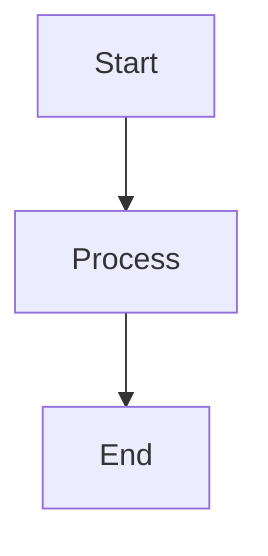

# Documentation Development Guide

This directory contains the comprehensive documentation for the Academic Citation Platform, built with **Material for MkDocs**.

## 📁 Documentation Structure

```
docs/
├── index.md                          # Homepage
├── getting-started/                  # Installation and setup guides
│   ├── installation.md              
│   ├── configuration.md             
│   ├── quick-start.md               
│   └── environment-setup.md         
├── user-guide/                      # User documentation
│   ├── overview.md                  
│   ├── interactive-features.md     
│   ├── ml-predictions.md           
│   ├── network-analysis.md         
│   ├── notebook-pipeline.md        
│   └── results-interpretation.md   
├── developer-guide/                 # Developer documentation
│   ├── architecture.md             
│   ├── api-reference.md            
│   ├── database-schema.md          
│   ├── services-layer.md           
│   ├── testing.md                  
│   └── contributing.md             
├── notebooks/                       # Notebook documentation
│   ├── overview.md                 
│   ├── 01-comprehensive-exploration.md
│   ├── 02-model-training-pipeline.md
│   ├── 03-prediction-evaluation.md
│   └── 04-narrative-presentation.md
├── advanced/                        # Advanced topics
│   ├── custom-models.md            
│   ├── performance-optimization.md 
│   ├── integration-patterns.md     
│   └── troubleshooting.md          
├── api/                             # API documentation
│   ├── services.md                 
│   ├── models.md                   
│   ├── analytics.md                
│   └── data.md                     
├── assets/                          # Static assets
│   └── images/                     
├── overrides/                       # Theme customization
│   └── main.html                   
└── includes/                        # Reusable content
    └── mkdocs.md                   
```

## 🚀 Local Development

### Prerequisites

Install documentation dependencies:

```bash
# Install MkDocs and Material theme
pip install -r docs-requirements.txt

# Or install from project dependencies
pip install -e ".[docs]"  # If added to pyproject.toml
```

### Development Server

Run the live development server:

```bash
# Start development server with live reload
mkdocs serve

# Start on custom port
mkdocs serve --dev-addr localhost:8001

# Enable strict mode (fails on warnings)
mkdocs serve --strict
```

The documentation will be available at `http://localhost:8000` with:
- ✅ **Live reload** on file changes
- ✅ **Navigation menu** with full structure
- ✅ **Search functionality** across all content
- ✅ **Interactive features** like code copying

### Building Documentation

Build static documentation:

```bash
# Build documentation site
mkdocs build

# Build with strict mode (recommended)
mkdocs build --strict

# Clean previous build
mkdocs build --clean

# Build to custom directory
mkdocs build --site-dir custom_site_dir/
```

## 🎨 Customization Guide

### Theme Configuration

The main theme configuration is in `mkdocs.yml`:

```yaml
theme:
  name: material
  palette:
    # Light mode
    - media: "(prefers-color-scheme: light)"
      scheme: default
      primary: blue grey
      accent: deep orange
      toggle:
        icon: material/brightness-7
        name: Switch to dark mode
    
    # Dark mode  
    - media: "(prefers-color-scheme: dark)"
      scheme: slate
      primary: blue grey
      accent: deep orange
      toggle:
        icon: material/brightness-4
        name: Switch to light mode
```

### Custom Styling

Additional styling is in `docs/overrides/main.html`:

- **Academic theme colors** with research-focused palette
- **Enhanced code blocks** with syntax highlighting
- **Notebook-style cells** for Jupyter integration
- **Citation-specific styling** for academic references
- **Mobile responsive** design optimizations

### Adding New Content

#### 1. Create New Pages

```bash
# Create new documentation page
touch docs/new-section/new-page.md

# Add to navigation in mkdocs.yml
nav:
  - New Section:
    - New Page: new-section/new-page.md
```

#### 2. Page Template

Use this template for new pages:

```markdown
# Page Title

Brief description of the page content and purpose.

## Overview

Explanation of what this page covers...

## Getting Started

Step-by-step instructions...

## Advanced Usage

More complex scenarios...

## Examples

Code examples with explanations...

## Troubleshooting

Common issues and solutions...

## Next Steps

Links to related documentation...
```

#### 3. Add API Documentation

For Python API documentation using `mkdocstrings`:

```markdown
# Module Title

Description of the module...

## Class or Function Name

::: path.to.module.ClassName
    options:
      show_root_heading: true
      show_source: false
      heading_level: 3
      members:
        - method1
        - method2
```

## 📝 Writing Guidelines

### Content Standards

1. **Clear Structure**: Use consistent heading hierarchy
2. **Code Examples**: Include practical, working examples
3. **Visual Elements**: Use diagrams, screenshots, and interactive elements
4. **Cross-References**: Link related sections and external resources
5. **Mobile-Friendly**: Ensure content works on mobile devices

### Markdown Extensions

The documentation supports advanced markdown features:

#### Admonitions

```markdown
!!! tip "Pro Tip"
    This is a helpful tip for users.

!!! warning "Important"
    This is something users should be careful about.

!!! danger "Critical"
    This is a critical warning.
```

#### Code Blocks with Highlighting

```markdown
```python title="example.py" linenums="1"
def example_function():
    """Example with line numbers and title."""
    return "Hello, World!"
```

#### Tabbed Content

```markdown
=== "Python"
    ```python
    print("Python example")
    ```

=== "JavaScript"
    ```javascript
    console.log("JavaScript example");
    ```
```

#### Mermaid Diagrams

```markdown


## 🔧 Configuration Reference

### Core Settings

Key configuration options in `mkdocs.yml`:

```yaml
# Site information
site_name: Academic Citation Platform
site_description: Comprehensive platform for academic citation analysis
site_url: https://citationcompass.barbhs.com

# Repository
repo_name: academic-citation-platform
repo_url: https://github.com/dagny099/citation-compass

# Theme configuration
theme:
  name: material
  features:
    - navigation.instant      # Single-page application
    - navigation.tracking     # URL updates with scroll
    - navigation.tabs         # Top-level sections as tabs
    - navigation.sections     # Group navigation items
    - toc.follow             # Follow table of contents
    - search.highlight       # Highlight search terms
```

### Plugin Configuration

Essential plugins for the platform:

```yaml
plugins:
  - search:                  # Full-text search
      separator: '[\s\-,:!=\[\]()"`/]+|\.(?!\d)|&[lg]t;|(?!\b)(?=[A-Z][a-z])'
  - mkdocstrings:           # API documentation from docstrings
      handlers:
        python:
          paths: [src]
  - git-revision-date-localized:  # Show last update dates
      enable_creation_date: true
```

### Analytics and Tracking

```yaml
extra:
  analytics:
    provider: google
    property: !ENV GOOGLE_ANALYTICS_KEY
  social:
    - icon: fontawesome/brands/github
      link: https://github.com/dagny099/citation-compass
```

## 📊 Performance Optimization

### Build Optimization

1. **Minimize plugins** - Only use necessary plugins
2. **Optimize images** - Compress images in `assets/images/`
3. **Enable caching** - Use `--strict` mode for production builds
4. **Monitor build time** - Track build performance

### Search Optimization

1. **Custom separators** - Improve search accuracy
2. **Search exclusions** - Exclude generated content
3. **Index optimization** - Configure search indexing

## 🚀 Deployment

### GitHub Pages

Deploy to GitHub Pages:

```bash
# Deploy to GitHub Pages
mkdocs gh-deploy

# Deploy with custom commit message
mkdocs gh-deploy --message "Update documentation"

# Deploy from specific directory
mkdocs gh-deploy --config-file custom-mkdocs.yml
```

### Custom Domain

For custom domain deployment:

1. **Configure CNAME**: Add `CNAME` file to `docs/` directory
2. **Update site_url**: Set correct URL in `mkdocs.yml`
3. **Enable HTTPS**: Configure SSL/TLS certificates

### CI/CD Integration

Example GitHub Actions workflow:

```yaml
name: Build Documentation
on:
  push:
    branches: [main]
    paths: ['docs/**', 'mkdocs.yml']

jobs:
  deploy:
    runs-on: ubuntu-latest
    steps:
      - uses: actions/checkout@v3
      - uses: actions/setup-python@v4
        with:
          python-version: 3.9
      - run: pip install -r docs-requirements.txt
      - run: mkdocs build --strict
      - run: mkdocs gh-deploy --force
```

## 🔍 Quality Assurance

### Pre-deployment Checklist

- [ ] All links work (internal and external)
- [ ] Code examples execute successfully  
- [ ] Images display correctly
- [ ] Navigation structure is logical
- [ ] Search functionality works
- [ ] Mobile responsiveness verified
- [ ] Loading performance acceptable
- [ ] Cross-browser compatibility tested

### Content Review

- [ ] Technical accuracy verified
- [ ] Writing clarity and consistency
- [ ] Code examples follow best practices
- [ ] Screenshots and diagrams up-to-date
- [ ] Accessibility guidelines followed

## 🤝 Contributing

### Documentation Contributors

1. **Fork** the repository
2. **Create** feature branch for documentation changes
3. **Write** following style guide and templates
4. **Test** locally with `mkdocs serve`
5. **Submit** pull request with clear description

### Review Process

Documentation changes go through:

1. **Automated checks** - Linting, link validation, build tests
2. **Peer review** - Technical accuracy and clarity
3. **User testing** - Usability and completeness
4. **Final approval** - Maintainer review and merge

---

This documentation system provides a solid foundation for comprehensive, maintainable, and user-friendly platform documentation! 📚✨