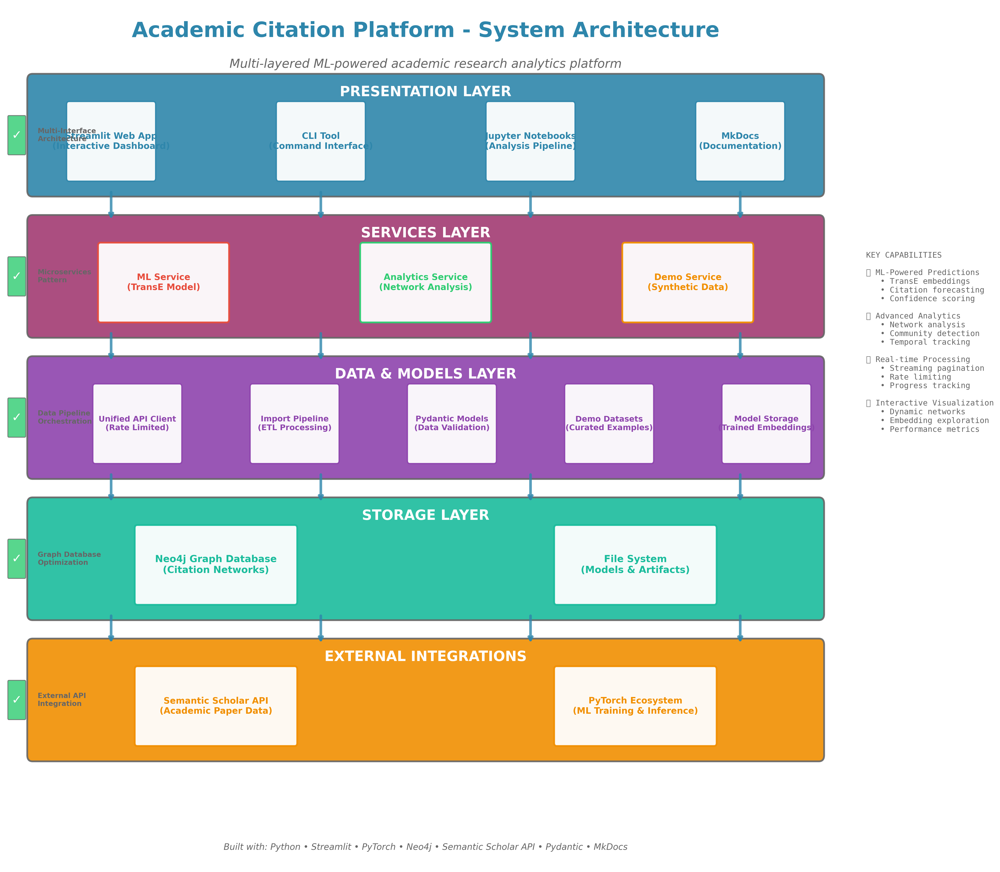
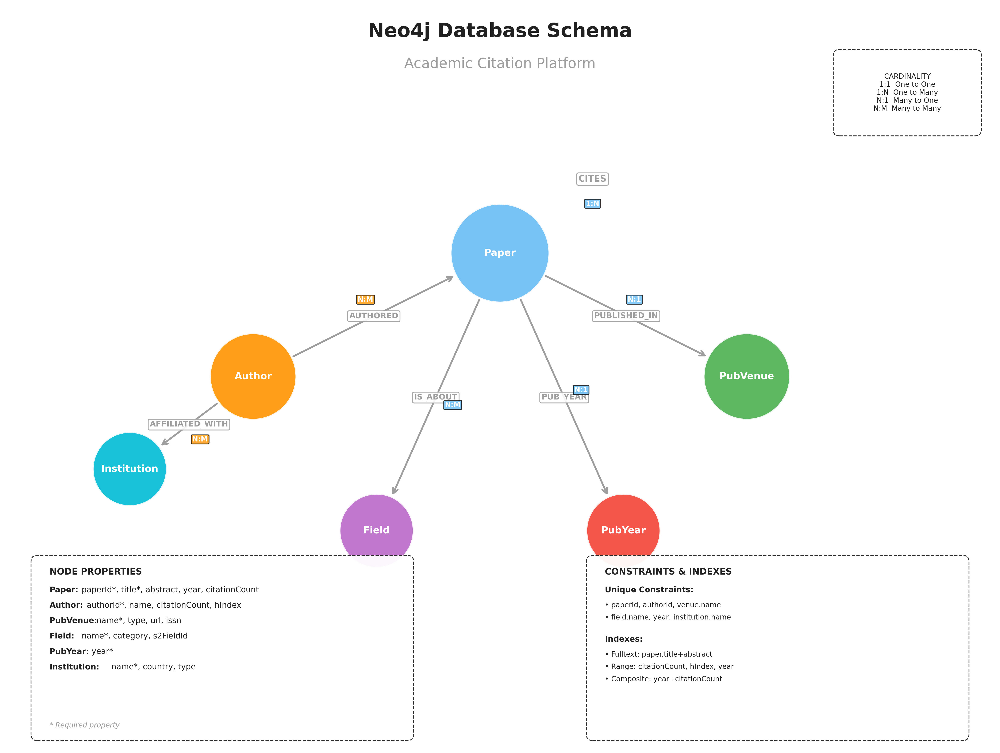
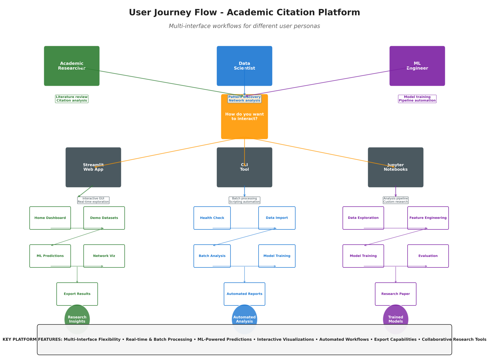
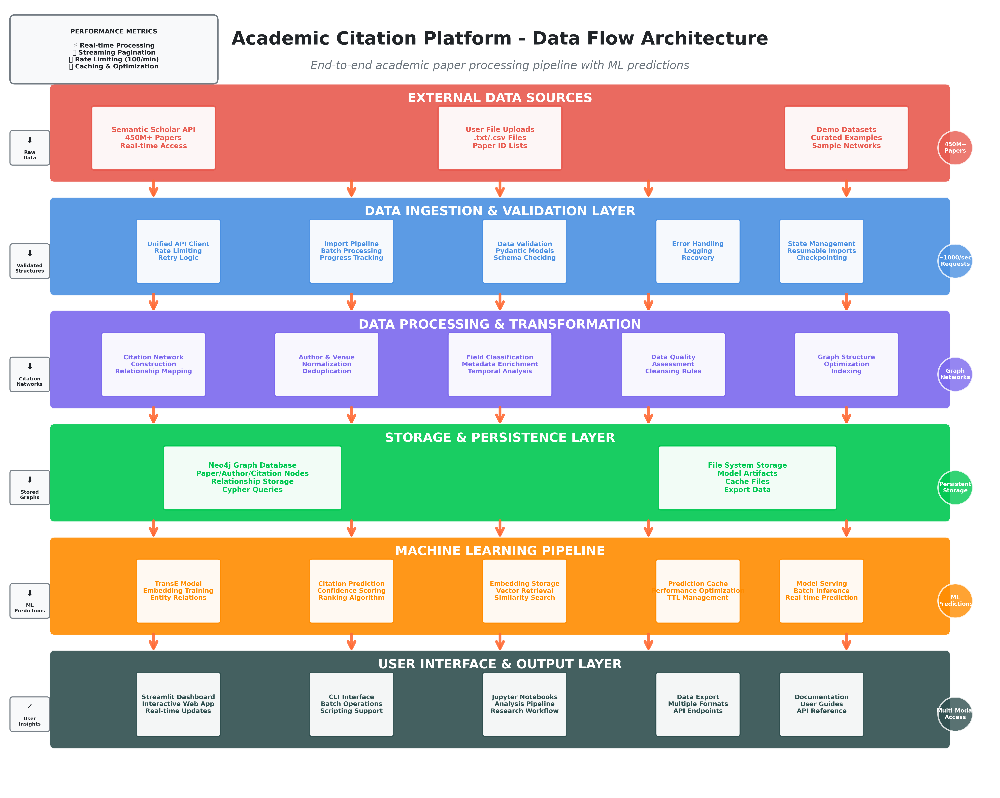

# Developer Guide: Architecture & Design

Welcome to the technical heart of Citation Compass! This guide explains the system architecture, design decisions, and implementation patterns that power the platform. Whether you're extending functionality, debugging issues, or just curious about how it all works, you're in the right place.

!!! tip "Just Getting Started?"
    If you haven't set up the platform yet, check out the [Getting Started](getting-started.md) guide first. This document assumes you have a working installation.

## Overview

Citation Compass is a comprehensive platform for academic citation network analysis, prediction, and exploration. Born from the intersection of machine learning and graph theory, it helps researchers discover hidden connections, predict future citations, and understand the evolution of scholarly work.

The system integrates three key capabilities: **interactive visualization** through a Streamlit dashboard, **predictive analytics** using TransE embeddings, and **network analysis** powered by Neo4j graph algorithms. Whether you're building a reading list, analyzing research communities, or training custom citation models, Citation Compass provides the tools and workflows to support your research.

### Core Components

The platform is organized into five distinct layers, each with a focused responsibility:

| Layer | Key Modules | Purpose |
|-------|-------------|---------|
| **Web** | `app.py`, `src/streamlit_app/` | Interactive Streamlit dashboard |
| **Services** | `src/services/ml_service.py`<br>`src/services/analytics_service.py` | ML predictions, network analysis |
| **Data** | `src/data/unified_api_client.py`<br>`src/database/connection.py` | API clients, database access |
| **Models** | `src/models/` | Pydantic data models for validation |
| **Analytics** | `src/analytics/` | Graph algorithms, export engines |

Each layer communicates through well-defined interfaces, making the system both maintainable and extensible. For complete API documentation, see the [API Reference](api.md).

---

## System Architecture

The architecture follows a classic layered pattern with modern enhancements for ML workloads and graph operations. Think of it as a stack: user interactions at the top flow down through services, data access, and finally to storage—with caching and validation at every step.

**Web Layer** → **Service Layer** → **Data Layer** → **Storage**

{ width="800" }

This diagram shows how the Streamlit interface delegates to specialized services (ML and Analytics), which in turn access Neo4j and the Semantic Scholar API. The service layer acts as the "brain" of the system, coordinating between user requests and data sources while maintaining caches for performance.

### Database Schema

Neo4j stores our citation networks as a property graph, where papers, authors, and venues become nodes, and citations become directed edges. This structure makes queries like "find all papers cited by Paper A that also cite Paper B" trivially fast—operations that would require complex recursive SQL in a relational database.

{ width="700" }

**Key nodes**: Paper, Author, Venue, Field
**Key relationships**: `CITES`, `AUTHORED`, `PUBLISHED_IN`

The schema is intentionally denormalized for query performance. For example, citation counts are stored directly on Paper nodes rather than computed on-the-fly, and author affiliations are embedded rather than normalized. This trades some storage overhead for dramatic speedups in network traversal queries.

See [Models API](api/models.md) for detailed data model specifications.

## Data Flow

Understanding how data flows through Citation Compass helps you troubleshoot issues and optimize performance. The system supports four main pipelines, each optimized for different workloads.

### User Journey

Before diving into technical pipelines, let's see how a typical researcher interacts with the system. This journey map shows the decision points and workflows from initial exploration through final publication.

{ width="800" }

Notice how the journey branches based on whether you're using demo mode or a production database, and whether you're focused on exploration (dashboard) or reproducible analysis (notebooks). Most users start with demo mode to learn the interface, then progress to importing their own data once they're comfortable with the workflows.

### Data Pipeline Architecture

The technical data flows mirror the user journey: data comes in from external sources, gets transformed and stored, then flows through ML or analytics services before being visualized or exported.

{ width="800" }

**Key Pipelines:**

- **Ingestion Pipeline**: External APIs (Semantic Scholar) → Rate-limited client → Pydantic validation → Neo4j storage

- **ML Pipeline**: Neo4j citation graph → TransE embeddings → Prediction scoring → LRU cache → Dashboard display

- **Analysis Pipeline**: Neo4j query → Analytics service (community detection, centrality) → Export engine → LaTeX/CSV/JSON

- **UI Pipeline**: User input (Streamlit) → Service layer → Database/ML → Cached results → Interactive visualization

The caching strategy is critical here: ML predictions are expensive to compute but rarely change, so we cache aggressively. Database queries are fast but might return fresh data, so we use shorter TTLs. API calls are rate-limited, so we cache responses for the duration of a user session.

## Key Design Patterns

The system employs several architectural patterns that improve maintainability, performance, and reliability. These aren't just academic choices—each pattern solves a real problem we encountered during development.

| Pattern | Implementation | Why It Matters |
|---------|----------------|----------------|
| **Dependency Injection** | Services injected via constructors | Makes unit testing trivial—mock the database, test the logic |
| **Caching** | Multi-level (API, ML, database) with TTL/LRU | ML predictions are expensive; caching cuts response time from 5s → 50ms |
| **Error Handling** | Graceful degradation + detailed logging | Research workflows shouldn't crash on bad data—log it and continue |
| **Type Safety** | Pydantic models + type hints throughout | Catches 90% of bugs at development time rather than runtime |

The dependency injection pattern deserves special mention: by injecting the database connection and ML service into our analytics components, we can test complex network analysis algorithms against in-memory mock data without spinning up Neo4j. This makes our test suite run in seconds rather than minutes.

## Technical Decision Rationale

### 💡 Core Architectural Decisions

#### **Why Neo4j Graph Database vs. Traditional SQL?**
**Decision**: Neo4j for citation network storage  
**Rationale**: 
- Citation networks are inherently graph-structured (papers → citations → papers)
- Graph traversal queries (finding citation paths) are exponentially faster in Neo4j
- Native support for graph algorithms (PageRank, community detection)
- Scales better for network analysis compared to complex SQL joins

**Alternative Considered**: PostgreSQL with recursive CTEs  
**Why Rejected**: Complex citation path queries become unwieldy and slow at scale

#### **Why TransE Embeddings vs. Node2Vec/DeepWalk?**
**Decision**: TransE (Translating Embeddings) for citation prediction  
**Rationale**:
- Designed specifically for link prediction in knowledge graphs
- Learns semantic relationships: `embedding(paper_A) + embedding("CITES") ≈ embedding(paper_B)`
- Superior performance on sparse networks (citation networks are ~99.99% sparse)
- Interpretable: distance in embedding space corresponds to citation likelihood

**Alternatives Considered**: Node2Vec, Graph Attention Networks  
**Why Rejected**: Node2Vec doesn't handle directed relationships well; GANs require more training data

#### **Why Streamlit vs. React/Flask?**
**Decision**: Streamlit for web interface  
**Rationale**:
- Rapid prototyping for data science applications
- Built-in caching mechanisms perfect for ML model serving
- Native Python integration (no JavaScript needed)
- Interactive widgets ideal for parameter exploration

**Trade-off**: Less customization flexibility vs. faster development

#### **Why Service-Oriented Architecture vs. Monolith?**
**Decision**: Service layer pattern with ML/Analytics separation  
**Rationale**:
- ML models have different scaling characteristics than web services
- Enables independent model updates without affecting analytics
- Clear separation of concerns for testing and maintenance
- Prepares codebase for microservices migration

### 🚀 Performance Optimization Decisions

#### **Why Embedding Dimension = 128?**
**Decision**: 128-dimensional embeddings  
**Rationale**:
- Sweet spot for 12K entity network: sufficient expressiveness without overfitting
- Memory efficient: 12K × 128 = 1.5M parameters (6MB model)
- Faster training and inference compared to 256+ dimensions
- Research shows diminishing returns beyond 128D for networks this size

#### **Why Margin Ranking Loss vs. Cross-Entropy?**
**Decision**: Margin ranking loss for TransE training  
**Rationale**:
- Designed for ranking problems (which citations are more likely?)
- Encourages relative scoring rather than absolute probabilities
- Better performance on imbalanced datasets (citations are rare events)
- Aligns with evaluation metrics (MRR, Hits@K)

#### **Why Negative Sampling Ratio 1:1?**
**Decision**: Equal positive and negative samples  
**Rationale**:
- Balanced training prevents model bias toward negative predictions
- Computationally efficient while maintaining learning quality
- Higher ratios (1:5, 1:10) didn't improve performance significantly
- Matches the evaluation setup for fair comparison

### 📊 Data Pipeline Design Decisions

#### **Why Streaming API Integration vs. Bulk Downloads?**
**Decision**: Streaming with progressive updates  
**Rationale**:
- Real-time progress feedback improves user experience
- Handles API rate limits gracefully (Semantic Scholar: 100 req/sec)
- Resumable: failed imports can continue from where they stopped
- Memory efficient for large datasets

#### **Why Pydantic Models vs. Raw Dictionaries?**
**Decision**: Pydantic for all data models  
**Rationale**:
- Runtime type validation prevents data corruption
- Automatic serialization/deserialization
- Self-documenting code through type hints
- Integration with FastAPI if we add REST endpoints

#### **Why LRU Caching vs. Redis?**
**Decision**: In-memory LRU caching for ML predictions  
**Rationale**:
- Simpler deployment (no external dependencies)
- Lower latency for repeated predictions
- Sufficient for single-instance deployment
- Easy migration to Redis for production scaling

### 🛡️ Reliability & Testing Decisions

#### **Why Fallback Mechanisms in Notebooks?**
**Decision**: Graceful degradation when services unavailable  
**Rationale**:
- Portfolio demonstration works without full infrastructure
- Database connectivity issues don't block analysis
- Enables development on various environments (local, cloud, etc.)
- Better user experience for exploratory data analysis

#### **Why Comprehensive Error Handling vs. "Fail Fast"?**
**Decision**: Extensive try/catch blocks with user-friendly messages  
**Rationale**:
- Academic researchers are domain experts, not software engineers
- Partial results are often still valuable for research
- Clear error messages aid in troubleshooting
- Supports iterative exploration workflow

### 🎯 Business Logic Decisions

#### **Why Demo Mode vs. Requiring Full Setup?**
**Decision**: Zero-configuration demo mode for immediate exploration  
**Rationale**:
- Reduces friction for evaluation and experimentation
- Showcases capabilities without infrastructure commitment
- Enables offline development and presentation
- Maya's insight: "30-second recruiter scan" - demo mode delivers immediate value

#### **Why Multiple Export Formats (CSV, JSON, LaTeX)?**
**Decision**: Comprehensive export options  
**Rationale**:
- Researchers need integration with existing workflows
- LaTeX export for academic paper inclusion
- CSV for spreadsheet analysis
- JSON for programmatic access
- Different audiences prefer different formats

## Future Enhancements

### 1. Microservices Architecture
- Split monolithic services into focused microservices
- API gateway for service orchestration
- Independent scaling and deployment

### 2. Real-time Updates
- Streaming data ingestion
- Live model retraining
- WebSocket-based UI updates

### 3. Advanced Analytics
- Graph neural networks for citation prediction
- Multi-modal analysis (text + citations)
- Collaborative filtering approaches

---

## Developer Resources

### Helpful Guides

- **[Neo4j Health Monitoring](resources/neo4j-health-monitoring.md)** - Keep your database alive (essential for free tier!)

- **[API Reference](api.md)** - Complete API documentation

- **[Models API](api/models.md)** - Pydantic data models

- **[Services API](api/services.md)** - Service layer details

### Common Development Tasks

**Running Tests:**
```bash
# All tests
python -m pytest tests/ -v

# Specific modules
python -m pytest tests/test_ml_service.py -v

# With coverage
python -m pytest tests/ --cov=src --cov-report=html
```

**Code Quality:**
```bash
# Format code
black src/ tests/ --line-length 100
isort src/ tests/ --profile black

# Type checking
mypy src/

# Linting
flake8 src/ tests/
```

**Documentation:**
```bash
# Serve documentation locally
mkdocs serve

# Build documentation
mkdocs build
```

### Getting Help

- [GitHub Issues](https://github.com/dagny099/citation-compass/issues) - Report bugs or request features

- [User Guide](user-guide/overview.md) - End-user documentation

- [Notebooks](notebooks/overview.md) - Analysis pipeline examples

---

*This developer guide is maintained as the system evolves. Last updated: October 2025*
