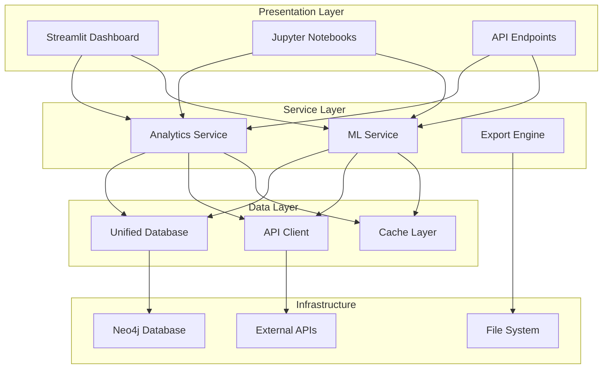

# Platform Architecture

Deep dive into the Academic Citation Platform's architecture, design principles, and core components.

## System Overview

The Academic Citation Platform follows a **layered architecture** with clear separation of concerns, designed for scalability, maintainability, and extensibility.



## Core Design Principles

### 1. **Separation of Concerns**

Each layer has distinct responsibilities:

- **Presentation**: User interfaces and data visualization
- **Service**: Business logic and orchestration
- **Data**: Data access, caching, and external integration
- **Infrastructure**: Storage, APIs, and system resources

### 2. **Dependency Injection**

Services are loosely coupled through dependency injection:

```python
# Service factory pattern
def get_analytics_service() -> AnalyticsService:
    db = get_database_manager()
    cache = get_cache_service()
    return AnalyticsService(database=db, cache=cache)
```

### 3. **Configuration-Driven**

All components use environment-based configuration:

```python
@dataclass
class ServiceConfig:
    max_workers: int = field(default_factory=lambda: int(os.getenv('MAX_WORKERS', '4')))
    cache_ttl: int = field(default_factory=lambda: int(os.getenv('CACHE_TTL', '3600')))
    request_timeout: int = field(default_factory=lambda: int(os.getenv('REQUEST_TIMEOUT', '300')))
```

### 4. **Async/Parallel Processing**

Critical paths support concurrent execution:

```python
async def process_batch_predictions(self, paper_ids: List[str]) -> List[Prediction]:
    tasks = [self.predict_citations(paper_id) for paper_id in paper_ids]
    return await asyncio.gather(*tasks)
```

## Layer-by-Layer Architecture

### Presentation Layer

#### Streamlit Dashboard (`src/streamlit_app/`)

**Purpose**: Interactive web interface for exploratory analysis

**Key Components**:
- **Multi-page architecture** with navigation
- **Real-time visualization** using Plotly and Streamlit
- **State management** for user sessions
- **Export integration** for sharing results

```python
# Page structure
src/streamlit_app/
├── __init__.py
├── pages/
│   ├── ML_Predictions.py      # Citation prediction interface
│   ├── Network_Analysis.py    # Community detection and metrics
│   ├── Embedding_Explorer.py  # Vector space visualization
│   └── Results_Export.py      # Report generation
```

#### Jupyter Notebooks (`notebooks/`)

**Purpose**: Comprehensive analysis workflows and research pipelines

**4-Notebook Architecture**:
1. **01_comprehensive_exploration.ipynb**: Network statistics and temporal analysis
2. **02_model_training_pipeline.ipynb**: TransE model training and validation
3. **03_prediction_evaluation.ipynb**: Evaluation metrics and performance testing
4. **04_narrative_presentation.ipynb**: Story-driven result presentation

### Service Layer

#### Analytics Service (`src/services/analytics_service.py`)

**Purpose**: Orchestrates all analytical operations

**Core Capabilities**:

```python
class AnalyticsService:
    def __init__(self, database: UnifiedDatabase, ml_service: MLService):
        self.database = database
        self.ml_service = ml_service
        self.network_analyzer = NetworkAnalyzer()
        self.temporal_analyzer = TemporalAnalyzer()
    
    # Network analysis operations
    async def analyze_network(self, config: AnalysisConfig) -> NetworkAnalysis
    async def detect_communities(self, method: str = 'louvain') -> CommunityDetection
    async def compute_centrality(self, measures: List[str]) -> CentralityAnalysis
    
    # Temporal analysis operations  
    async def analyze_temporal_trends(self, time_window: TimeWindow) -> TemporalAnalysis
    async def predict_growth_patterns(self, paper_ids: List[str]) -> GrowthPrediction
```

**Architecture Pattern**: **Composition over Inheritance**

```python
# Composable analyzers
class AnalyticsService:
    def __init__(self):
        self.analyzers = {
            'network': NetworkAnalyzer(),
            'temporal': TemporalAnalyzer(), 
            'performance': PerformanceAnalyzer(),
            'export': ExportEngine()
        }
```

#### ML Service (`src/services/ml_service.py`)

**Purpose**: Machine learning model management and predictions

**Core Architecture**:

```python
class MLService:
    def __init__(self):
        self.model_manager = ModelManager()
        self.prediction_cache = PredictionCache()
        self.embedding_service = EmbeddingService()
    
    # Prediction operations
    async def predict_citations(self, paper_id: str, top_k: int = 10) -> List[Prediction]
    async def compute_embeddings(self, paper_ids: List[str]) -> np.ndarray
    async def find_similar_papers(self, paper_id: str, threshold: float = 0.8) -> List[Paper]
    
    # Model management
    async def train_model(self, config: TrainingConfig) -> TrainingResult
    async def evaluate_model(self, test_data: TestDataset) -> EvaluationResult
    async def load_model(self, model_path: str) -> bool
```

**Model Architecture**: **TransE (Translating Embeddings)**

```python
class TransE(torch.nn.Module):
    def __init__(self, num_entities: int, embedding_dim: int, margin: float = 1.0):
        super().__init__()
        self.entity_embeddings = nn.Embedding(num_entities, embedding_dim)
        self.relation_embedding = nn.Embedding(1, embedding_dim)  # Single citation relation
        self.margin = margin
    
    def forward(self, head_indices: torch.Tensor, tail_indices: torch.Tensor) -> torch.Tensor:
        # TransE scoring: ||h + r - t||
        head_emb = self.entity_embeddings(head_indices)
        tail_emb = self.entity_embeddings(tail_indices)  
        relation_emb = self.relation_embedding.weight[0]
        
        scores = torch.norm(head_emb + relation_emb - tail_emb, p=1, dim=1)
        return scores
```

### Data Layer

#### Unified Database (`src/data/unified_database.py`)

**Purpose**: Abstracted data access layer for Neo4j operations

**Repository Pattern Implementation**:

```python
class UnifiedDatabase:
    def __init__(self):
        self.connection = Neo4jConnection()
        self.query_cache = QueryCache()
        self.validator = DataValidator()
    
    # Core data access methods
    async def get_papers(self, filters: Dict[str, Any] = None) -> List[Paper]
    async def get_citations(self, paper_id: str) -> List[Citation] 
    async def get_authors(self, affiliation: str = None) -> List[Author]
    
    # Network-specific queries
    async def get_citation_network(self, depth: int = 2) -> NetworkGraph
    async def get_community_subgraph(self, community_ids: List[str]) -> NetworkGraph
    
    # Performance-optimized batch operations
    async def batch_get_papers(self, paper_ids: List[str]) -> Dict[str, Paper]
    async def batch_get_citations(self, paper_ids: List[str]) -> Dict[str, List[Citation]]
```

**Query Optimization Strategies**:

1. **Prepared Statements**: Pre-compiled Cypher queries
2. **Connection Pooling**: Efficient database connection management
3. **Result Caching**: Intelligent caching of frequent queries
4. **Batch Operations**: Minimize round-trips for bulk data access

#### API Client (`src/data/unified_api_client.py`)

**Purpose**: External API integration with rate limiting and caching

```python
class UnifiedSemanticScholarClient:
    def __init__(self):
        self.rate_limiter = RateLimiter(requests_per_minute=100)
        self.cache = APICache(ttl=3600)
        self.session = httpx.AsyncClient()
    
    @rate_limit
    @cache_result
    async def get_paper_details(self, paper_id: str) -> PaperDetails:
        # Fetch paper metadata from Semantic Scholar
        
    @rate_limit  
    @cache_result
    async def get_paper_citations(self, paper_id: str) -> List[Citation]:
        # Fetch citation relationships
```

## Component Interactions

### Service Orchestration

The platform uses an **event-driven architecture** for complex operations:

```python
class AnalyticsWorkflow:
    async def run_comprehensive_analysis(self, config: AnalysisConfig) -> AnalysisResult:
        # Step 1: Load data
        papers = await self.database.get_papers(config.filters)
        
        # Step 2: Network analysis (parallel)
        network_task = asyncio.create_task(
            self.analytics.analyze_network(papers)
        )
        
        # Step 3: ML predictions (parallel) 
        prediction_task = asyncio.create_task(
            self.ml_service.predict_batch_citations(papers)
        )
        
        # Step 4: Wait for completion
        network_result, predictions = await asyncio.gather(
            network_task, prediction_task
        )
        
        # Step 5: Generate comprehensive report
        return self.export_engine.generate_report(
            network_result, predictions, config
        )
```

### Error Handling & Resilience

**Graceful Degradation**: Services continue operating with reduced functionality:

```python
class ResilientMLService:
    async def predict_citations(self, paper_id: str) -> List[Prediction]:
        try:
            # Try full ML prediction
            return await self.model.predict(paper_id)
        except ModelUnavailableError:
            # Fallback to similarity-based predictions
            logger.warning("ML model unavailable, using similarity fallback")
            return await self.similarity_based_predict(paper_id)
        except Exception as e:
            # Final fallback to cached results
            logger.error(f"Prediction failed: {e}")
            return await self.get_cached_predictions(paper_id)
```

## Performance & Scalability

### Caching Strategy

**Multi-Level Caching**:

1. **L1 - In-Memory**: Fast access for active session data
2. **L2 - Redis**: Shared cache for frequently accessed data  
3. **L3 - Database**: Persistent storage with query optimization

```python
class CacheManager:
    def __init__(self):
        self.l1_cache = LRUCache(maxsize=1000)  # In-memory
        self.l2_cache = RedisCache(host='localhost', port=6379)  # Distributed
        self.l3_cache = DatabaseCache()  # Persistent
    
    async def get(self, key: str) -> Any:
        # Try L1 first
        if result := self.l1_cache.get(key):
            return result
            
        # Try L2 second  
        if result := await self.l2_cache.get(key):
            self.l1_cache[key] = result
            return result
            
        # Finally try L3
        if result := await self.l3_cache.get(key):
            self.l1_cache[key] = result
            await self.l2_cache.set(key, result)
            return result
        
        return None
```

### Parallel Processing

**Worker Pool Architecture**:

```python
class ParallelAnalyticsService:
    def __init__(self, max_workers: int = 4):
        self.executor = ThreadPoolExecutor(max_workers=max_workers)
        self.semaphore = asyncio.Semaphore(max_workers)
    
    async def process_batch_analysis(self, paper_batches: List[List[str]]) -> List[AnalysisResult]:
        tasks = []
        for batch in paper_batches:
            async with self.semaphore:
                task = asyncio.create_task(self.analyze_batch(batch))
                tasks.append(task)
        
        return await asyncio.gather(*tasks)
```

## Extension Points

### Plugin Architecture

The platform supports custom analyzers and models:

```python
# Custom analyzer plugin
class CustomCommunityDetector(CommunityDetector):
    def detect_communities(self, network: NetworkGraph) -> List[Community]:
        # Implement custom algorithm
        pass

# Register plugin
analytics_service.register_analyzer('custom_community', CustomCommunityDetector())
```

### Model Plugin System

```python
class ModelPlugin:
    def train(self, data: TrainingData) -> Model:
        raise NotImplementedError
        
    def predict(self, input_data: Any) -> Prediction:
        raise NotImplementedError

# Custom model implementation
class CustomTransEModel(ModelPlugin):
    def train(self, data: TrainingData) -> Model:
        # Custom training logic
        pass
```

## Testing Architecture

### Test Pyramid Strategy

```python
# Unit tests (fast, isolated)
class TestAnalyticsService:
    @pytest.fixture
    def mock_database(self):
        return MagicMock(spec=UnifiedDatabase)
    
    def test_network_analysis(self, mock_database):
        service = AnalyticsService(database=mock_database)
        # Test service logic in isolation

# Integration tests (medium speed, real components)
class TestDatabaseIntegration:
    @pytest.fixture
    def test_database(self):
        return get_test_database()
    
    def test_paper_retrieval(self, test_database):
        # Test real database operations

# End-to-end tests (slow, full system)
class TestE2EWorkflows:
    def test_complete_analysis_pipeline(self):
        # Test full user workflow
```

## Security Considerations

### Data Access Control

```python
class SecureAnalyticsService:
    def __init__(self, user_context: UserContext):
        self.user_context = user_context
        self.access_control = AccessControl()
    
    async def get_papers(self, filters: Dict) -> List[Paper]:
        # Check user permissions
        if not self.access_control.can_access_papers(self.user_context):
            raise UnauthorizedError()
            
        # Apply user-specific filters
        secure_filters = self.access_control.apply_filters(filters, self.user_context)
        return await self.database.get_papers(secure_filters)
```

### Input Validation

```python
class DataValidator:
    def validate_paper_id(self, paper_id: str) -> str:
        if not re.match(r'^[a-zA-Z0-9\-_]+$', paper_id):
            raise ValidationError("Invalid paper ID format")
        return paper_id
    
    def validate_analysis_config(self, config: dict) -> AnalysisConfig:
        schema = AnalysisConfigSchema()
        return schema.load(config)
```

## Monitoring & Observability

### Performance Metrics

```python
class PerformanceMonitor:
    def __init__(self):
        self.metrics = MetricsCollector()
        self.tracer = OpenTelemetryTracer()
    
    @trace_operation
    async def monitor_analysis(self, operation: str, func: Callable) -> Any:
        start_time = time.time()
        try:
            result = await func()
            self.metrics.record_success(operation, time.time() - start_time)
            return result
        except Exception as e:
            self.metrics.record_error(operation, str(e))
            raise
```

---

This architecture enables the Academic Citation Platform to scale from small research projects to large-scale citation network analysis while maintaining code quality, performance, and extensibility.