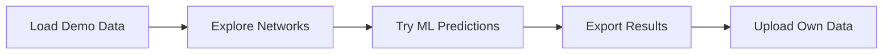
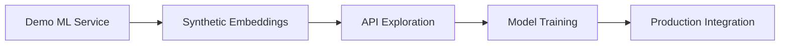
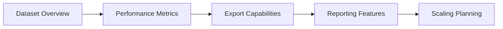

# Demo Mode - Try Before You Setup

Start exploring the Academic Citation Platform instantly with **no setup required**! Demo mode provides curated academic datasets and offline functionality to demonstrate all platform capabilities.

## 🚀 Why Start with Demo Mode?

=== "🎯 Instant Exploration"
    - **Zero setup time** - No database, API keys, or configuration needed
    - **Full functionality** - All features work offline with realistic data
    - **Risk-free learning** - Explore without affecting your own data
    - **Realistic results** - Curated academic papers from real research

=== "📚 Educational Value"
    - **Understanding ML training data** - See how models learn from citation patterns
    - **Research workflow mastery** - Learn analysis techniques with guided examples
    - **Best practices discovery** - Understand effective search and analysis strategies
    - **Performance benchmarking** - Compare different analysis approaches

=== "⚡ Quick Validation"
    - **Feature testing** - Try all tools before committing to full setup
    - **Performance evaluation** - Test on your hardware with realistic datasets
    - **Workflow validation** - Ensure the platform fits your research needs
    - **Integration planning** - Understand API and export capabilities

## 🎭 Accessing Demo Mode

### Step 1: Launch the Platform
```bash
streamlit run app.py
```

### Step 2: Navigate to Demo Datasets
1. **Open the sidebar** (click hamburger menu if needed)
2. **Select "Demo Datasets"** from the navigation menu
3. **Choose your dataset** from the available options

### Step 3: Load Sample Data
=== "Quick Start (Recommended)"
    1. **Click "complete_demo"** for the full experience
    2. **Press "Load Dataset"** button
    3. **Wait 2-3 seconds** for data to load
    4. **Explore all features** with realistic academic data

=== "Minimal Testing"
    1. **Select "minimal_demo_5papers"** for faster loading
    2. **Load dataset** for basic feature testing
    3. **Perfect for quick demos** and initial exploration

## 📊 Available Demo Datasets

### Complete Demo Dataset
- **13 high-impact papers** from multiple research fields
- **34 citation relationships** showing realistic academic networks
- **47 researchers** across 7 different fields
- **Temporal span**: 2009-2024 showing research evolution
- **Cross-disciplinary connections** between AI, neuroscience, and physics

**Research Fields Included**:
- 🤖 **Machine Learning** - Foundational papers like "Attention Is All You Need"
- 🧠 **Neuroscience** - Brain imaging and neural network research
- ⚛️ **Physics** - Quantum computing and computational physics
- 🔬 **Medical Informatics** - Healthcare AI and medical imaging
- 🤖 **Computer Vision** - Image recognition and deep learning
- 🎮 **Robotics** - Autonomous systems and control theory
- 🧠 **Psychology** - Cognitive science and behavioral research

### Minimal Demo Dataset
- **5 essential papers** for quick testing
- **5 citation relationships** showing basic network structure
- **22 researchers** demonstrating collaboration patterns
- **Perfect for**: Quick demos, testing, and development

### Quick Fixtures
- **Ultra-fast loading** datasets for specific testing scenarios
- **Targeted examples**: Collaboration networks, temporal patterns, cross-field research
- **Development testing**: Unit tests and feature validation

## 🔮 Demo ML Predictions

Demo mode includes a **realistic ML service** that works offline:

### Synthetic Embeddings
- **Field-aware clustering** - ML papers cluster together, physics papers cluster together
- **Realistic vector spaces** - Papers with similar topics have similar embeddings
- **Compatible with TransE models** - Works with existing ML infrastructure

### Intelligent Predictions
- **Temporal patterns** - Newer papers are more likely to cite foundational work
- **Field similarity** - Papers in related fields (ML ↔ Computer Vision) show higher citation probability
- **Impact weighting** - Highly-cited papers are more likely to be referenced
- **Cross-disciplinary discovery** - Find unexpected connections between research areas

### Confidence Scoring
- **Realistic confidence ranges** - Scores between 0.1-0.9 matching real-world patterns
- **Interpretable results** - Higher scores for more likely citations
- **Uncertainty quantification** - Lower confidence for cross-field predictions

## 🎨 Full Feature Access

All platform features work in demo mode:

### 🕸️ Network Analysis
- **Community detection** across research fields
- **Centrality analysis** identifying influential papers
- **Temporal dynamics** showing research evolution over time
- **Citation flow visualization** between different research areas

### 📈 Interactive Visualization
- **Clickable network graphs** for paper exploration
- **Real-time filtering** by field, year, or citation count
- **Zoom and pan** for detailed network investigation
- **Node highlighting** for citation path tracing

### 📊 Analytics & Export
- **Statistical summaries** of research networks
- **LaTeX table generation** for academic publications
- **Research insights** with traffic-light performance indicators
- **Custom report creation** with publication-ready formats

### 🤖 ML Exploration
- **Citation prediction** for any paper in the dataset
- **Embedding visualization** in 2D and 3D space
- **Similarity search** for related research papers
- **Confidence analysis** for prediction reliability

## 🔄 Switching Modes

### Demo → Production
When ready for real data:

1. **Setup Neo4j database** following [configuration guide](configuration.md)
2. **Add environment variables** to `.env` file
3. **Import your data** using [data import guide](../user-guide/data-import.md)
4. **Train your models** with the [notebook pipeline](../user-guide/notebook-pipeline.md)

### Production → Demo
Return to demo mode anytime:

1. **Navigate to Demo Datasets** page
2. **Load any demo dataset** to override production data
3. **All analysis tools** will use demo data and synthetic models
4. **Switch back** by reconnecting to your database

## 💡 Learning Pathways

### For New Researchers


1. **Start with complete_demo** to see realistic academic networks
2. **Explore citation relationships** between papers in different fields
3. **Try ML predictions** to understand how models find similar research
4. **Export analysis results** to see report generation capabilities
5. **Move to file upload** when ready for your own research data

### For Data Scientists


1. **Examine demo ML service** to understand prediction algorithms
2. **Explore synthetic embeddings** to see vector space organization
3. **Test Python API** with demo data for integration planning
4. **Review model training notebooks** for custom model development
5. **Plan production deployment** with realistic performance expectations

### For Research Administrators


1. **Review dataset statistics** to understand data requirements
2. **Monitor performance metrics** during analysis operations
3. **Test export capabilities** for institutional reporting needs
4. **Explore automated reporting** features for regular analysis
5. **Plan scaling** based on demo performance and requirements

## 🛠️ Technical Details

### Data Storage
- **In-memory processing** - No database required
- **Fast indexing** - Optimized for quick searches and analysis
- **Realistic performance** - Similar response times to production database
- **Memory efficient** - Minimal resource usage for demo datasets

### API Compatibility
- **Same interface** - All APIs work identically in demo and production modes
- **Seamless switching** - Change modes without code modifications
- **Full functionality** - Every feature accessible offline
- **Realistic responses** - API results match production patterns

### Performance Characteristics
- **Instant loading** - Demo datasets load in 2-3 seconds
- **Fast analysis** - Network computations complete in milliseconds
- **Realistic ML inference** - Prediction speeds match trained models
- **Smooth visualization** - Interactive graphics with 60fps rendering

## 🚨 Demo Mode Limitations

While demo mode provides full functionality, be aware of these constraints:

### Data Scope
- **Limited papers** - 13 papers vs thousands in production databases
- **Specific domains** - Focused on AI/ML/neuroscience research areas
- **Fixed timeframe** - 2009-2024 publication years only
- **Synthetic relationships** - Some citation patterns are constructed for demonstration

### Scalability Testing
- **Small networks** - Cannot test large-scale network analysis (10k+ papers)
- **Limited complexity** - Community detection with fewer research clusters
- **Memory usage** - Won't reveal memory requirements for large datasets
- **API throughput** - Cannot test high-volume API request patterns

### Model Training
- **No training data** - Cannot train new ML models with demo data
- **Fixed embeddings** - Synthetic embeddings don't improve with more data
- **Limited hyperparameters** - Cannot test different model configurations
- **No validation sets** - Cannot evaluate model performance improvements

## 🎉 Get Started Now!

Demo mode is the fastest way to understand the Academic Citation Platform's capabilities:

1. **[Launch the application](installation.md)** with `streamlit run app.py`
2. **Navigate to Demo Datasets** in the sidebar
3. **Load the complete_demo** dataset for the full experience
4. **Explore all features** with realistic academic research data
5. **Export your first analysis** to see publication-ready results

Ready to explore? The demo datasets are waiting! 🚀

---

## 🔗 **Related Guides**

**Next Steps**: 
- **[File Upload](file-upload.md)** - Import your own research data collections  
- **[Quick Start](quick-start.md)** - Complete setup and first analysis workflow
- **[Demo Datasets - User Guide](../user-guide/demo-datasets.md)** - Deep dive into all demo capabilities

**See Also**:
- **[Interactive Features](../user-guide/interactive-features.md)** - Complete guide to the web interface
- **[Data Import](../user-guide/data-import.md)** - Advanced import pipeline features
- **[Configuration](configuration.md)** - Production database setup