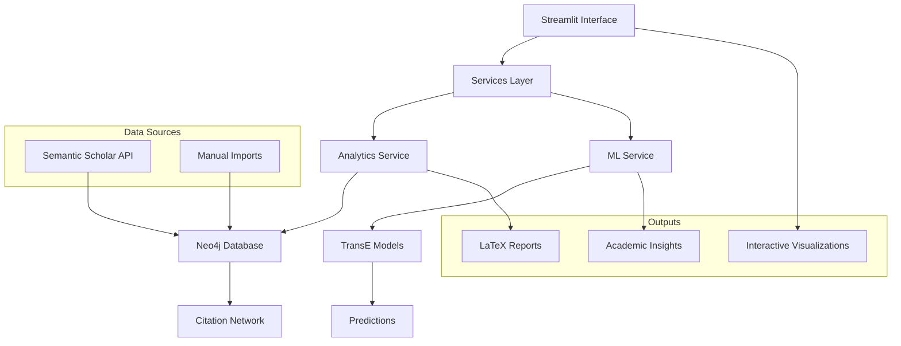

# Academic Citation Platform

<div align="center">

{ width="200" }

**Comprehensive platform for academic citation network analysis, prediction, and exploration**

[](https://python.org)
[](https://neo4j.com)
[](https://streamlit.io)
[](https://opensource.org/licenses/MIT)

[Get Started](getting-started/installation.md){ .md-button .md-button--primary }
[View Demo](https://citationcompass.barbhs.com){ .md-button }

</div>

---

## 🚀 What This Platform Does

The **Academic Citation Platform** is a sophisticated research tool that combines **machine learning**, **graph analysis**, and **interactive visualization** to provide deep insights into academic citation networks.

### :material-brain: **ML-Powered Predictions**
Discover hidden connections between research papers using advanced **TransE embeddings** and citation prediction algorithms.

### :material-graph: **Network Analysis** 
Explore citation networks with community detection, centrality measures, and temporal trend analysis.

### :material-chart-line: **Interactive Visualization**
Generate compelling visualizations and research narratives with our comprehensive **Streamlit interface**.

### :material-file-export: **Research Export**
Export results as **LaTeX tables**, academic reports, and publication-ready visualizations.

---

## ⚡ Quick Start

Get up and running in minutes:

=== "🐍 Python Installation"

    ```bash
    # Clone and install
    git clone https://github.com/your-org/academic-citation-platform.git
    cd academic-citation-platform
    pip install -e ".[all]"
    ```

=== "🔧 Configuration"

    ```bash
    # Copy environment configuration
    cp .env.example .env
    
    # Edit with your Neo4j database credentials
    NEO4J_URI=neo4j+s://your-database-url
    NEO4J_USER=neo4j  
    NEO4J_PASSWORD=your-password
    ```

=== "🚀 Launch"

    ```bash
    # Start the interactive application
    streamlit run app.py
    
    # Or run Jupyter notebooks
    jupyter notebook notebooks/
    ```

---

## 🎯 Key Features

### **Machine Learning Pipeline**

<div class="grid cards" markdown>

-   :material-robot: **TransE Model Training**
    
    Train citation prediction models using graph neural networks with comprehensive evaluation metrics (MRR, Hits@K, AUC).

-   :material-chart-bell-curve: **Prediction Confidence**
    
    Generate citation predictions with confidence scores and embedding visualizations.

-   :material-cached: **Intelligent Caching**
    
    Optimized performance with built-in caching for ML predictions and database queries.

</div>

### **Network Analytics**

<div class="grid cards" markdown>

-   :material-account-group: **Community Detection**
    
    Identify research communities using advanced algorithms (Louvain, Label Propagation).

-   :material-trending-up: **Temporal Analysis**
    
    Analyze citation trends over time with growth patterns and seasonal insights.

-   :material-star-circle: **Centrality Measures**
    
    Compute PageRank, betweenness, and eigenvector centrality for impact analysis.

</div>

### **Interactive Interface**

<div class="grid cards" markdown>

-   :material-application-brackets: **Streamlit Dashboard**
    
    Multi-page interactive interface for exploration, prediction, and visualization.

-   :material-notebook: **Research Notebooks**
    
    Comprehensive 4-notebook pipeline for end-to-end analysis workflows.

-   :material-export: **Export Engine**
    
    Generate LaTeX tables, academic reports, and publication-ready outputs.

</div>

---

## 📚 Documentation Sections

<div class="grid cards" markdown>

-   [:material-rocket-launch: **Getting Started**](getting-started/installation.md)
    
    Installation, configuration, and your first citation analysis

-   [:material-account: **User Guide**](user-guide/overview.md)
    
    Complete walkthrough of interactive features and workflows

-   [:material-code-braces: **Developer Guide**](developer-guide/architecture.md)
    
    Architecture, APIs, and extending the platform

-   [:material-notebook: **Research Notebooks**](notebooks/overview.md)
    
    Comprehensive analysis pipeline and methodology

</div>

---

## 🏗️ Architecture Overview



---

## 🤝 Community & Support

<div class="grid cards" markdown>

-   :material-github: **GitHub Repository**
    
    Source code, issues, and contributions welcome
    
    [View on GitHub](https://github.com/your-org/academic-citation-platform)

-   :material-help-circle: **Documentation**
    
    Comprehensive guides and API reference
    
    [Browse Documentation](getting-started/installation.md)

-   :material-email: **Contact**
    
    Questions, support, or collaboration inquiries
    
    [contact@citationcompass.com](mailto:contact@citationcompass.com)

</div>

---

## 📊 Sample Workflows

!!! example "Common Research Workflows"

    === "Citation Prediction"
        1. **Input a paper** → Get predicted citations → Validate with embeddings
        2. **Explore similar papers** → Build reading lists → Discover new research
    
    === "Network Analysis"
        1. **Select author/field** → Detect communities → Export LaTeX summary
        2. **Analyze collaborations** → Identify key researchers → Track influence
    
    === "Temporal Analysis"
        1. **Choose date range** → Analyze citation trends → Generate insights
        2. **Track paper impact** → Monitor growth patterns → Predict future citations

---

*Built with :material-heart: for the research community*