# Academic Citation Platform

<div class="hero-section" markdown>

<div align="center" markdown>

{ width="200" .hero-logo }

<h2 class="hero-tagline">Comprehensive platform for academic citation network analysis, prediction, and exploration</h2>

<div class="badge-container" markdown>
[](https://python.org)
[](https://neo4j.com)
[](https://streamlit.io)
[](https://opensource.org/licenses/MIT)
</div>

<div class="hero-buttons" markdown>
[🚀 Get Started](getting-started/installation.md){ .md-button .md-button--primary }
[🎯 Local Demo](http://localhost:8501/){ .md-button }
[📚 API Docs](api.md){ .md-button }
</div>

</div>

</div>

!!! tip "💡 What Makes This Platform Special"

    🧠 **AI-Powered Predictions** • 🕸️ **Network Analysis** • 📊 **Interactive Visualizations** • 📄 **Academic Reports**

---

## 🚀 What This Platform Does

The **Academic Citation Platform** is a sophisticated research tool that combines **machine learning**, **graph analysis**, and **interactive visualization** to provide deep insights into academic citation networks.

### :material-brain: **ML-Powered Predictions**
Discover hidden connections between research papers using advanced **TransE embeddings** and citation prediction algorithms.

### :material-graph: **Network Analysis** 
Explore citation networks with community detection, centrality measures, and temporal trend analysis.

### :material-chart-line: **Interactive Visualization**
Generate compelling visualizations and research narratives with our comprehensive **Streamlit interface**.

### :material-file-export: **Research Export**
Export results as **LaTeX tables**, academic reports, and publication-ready visualizations.

---

## ⚡ Quick Start

Get up and running in minutes:

=== "🐍 Python Installation"

    ```bash
    # Clone and install
    git clone https://github.com/dagny099/citation-compass.git
    cd citation-compass
    pip install -e ".[all]"
    ```

=== "🔧 Configuration"

    ```bash
    # Copy environment configuration
    cp .env.example .env
    
    # Edit with your Neo4j database credentials
    NEO4J_URI=neo4j+s://your-database-url
    NEO4J_USER=neo4j  
    NEO4J_PASSWORD=your-password
    ```

=== "🚀 Launch"

    ```bash
    # Start the interactive application
    streamlit run app.py
    # Opens at http://localhost:8501/
    
    # Or run Jupyter notebooks
    jupyter notebook notebooks/
    
    # View this documentation locally
    mkdocs serve
    # Opens at http://127.0.0.1:8000/
    ```

---

## 🎯 Key Features

### **Machine Learning Pipeline**

<div class="grid cards" markdown>

-   :material-robot: **TransE Model Training**
    
    Train citation prediction models using graph neural networks with comprehensive evaluation metrics (MRR, Hits@K, AUC).

-   :material-chart-bell-curve: **Prediction Confidence**
    
    Generate citation predictions with confidence scores and embedding visualizations.

-   :material-cached: **Intelligent Caching**
    
    Optimized performance with built-in caching for ML predictions and database queries.

</div>

### **Network Analytics**

<div class="grid cards" markdown>

-   :material-account-group: **Community Detection**
    
    Identify research communities using advanced algorithms (Louvain, Label Propagation).

-   :material-trending-up: **Temporal Analysis**
    
    Analyze citation trends over time with growth patterns and seasonal insights.

-   :material-star-circle: **Centrality Measures**
    
    Compute PageRank, betweenness, and eigenvector centrality for impact analysis.

</div>

### **Interactive Interface**

<div class="grid cards" markdown>

-   :material-application-brackets: **Streamlit Dashboard**
    
    Multi-page interactive interface for exploration, prediction, and visualization.

-   :material-notebook: **Research Notebooks**
    
    Comprehensive 4-notebook pipeline for end-to-end analysis workflows.

-   :material-export: **Export Engine**
    
    Generate LaTeX tables, academic reports, and publication-ready outputs.

</div>

---

## 📚 Documentation Sections

<div class="grid cards" markdown>

-   [:material-rocket-launch: **Getting Started**](getting-started/installation.md)
    
    Installation, configuration, and your first citation analysis

-   [:material-account: **User Guide**](user-guide/overview.md)
    
    Complete walkthrough of interactive features and workflows

-   [:material-code-braces: **Developer Guide**](developer-guide/architecture.md)
    
    Architecture, APIs, and extending the platform

-   [:material-notebook: **Research Notebooks**](notebooks/overview.md)
    
    Comprehensive analysis pipeline and methodology

</div>

---

## 🏗️ Architecture Overview

```mermaid
graph TB
    A["🖥️ Streamlit Interface<br/>Interactive Web App"] --> B["⚙️ Services Layer<br/>Core Business Logic"]
    B --> C["📊 Analytics Service<br/>Network Analysis"]
    B --> D["🧠 ML Service<br/>Citation Prediction"]
    C --> E["🗄️ Neo4j Database<br/>Graph Storage"]
    D --> F["🎯 TransE Models<br/>Knowledge Embeddings"]
    E --> G["🔗 Citation Network<br/>Academic Graph"]
    F --> H["🔮 Predictions<br/>Citation Forecasts"]
    
    subgraph "📡 Data Sources"
        I["🌐 Semantic Scholar API<br/>Academic Papers"]
        J["📂 Manual Imports<br/>Custom Datasets"]
    end
    
    I --> E
    J --> E
    
    subgraph "📈 Outputs"
        K["📊 Interactive Visualizations<br/>Web Dashboards"]
        L["📄 LaTeX Reports<br/>Academic Publications"]
        M["💡 Academic Insights<br/>Research Intelligence"]
    end
    
    A --> K
    C --> L
    D --> M
    
    style A fill:#e3f2fd
    style B fill:#f3e5f5
    style C fill:#e8f5e8
    style D fill:#fff3e0
    style E fill:#fce4ec
    style F fill:#f1f8e9
```



### 🔄 Data Flow Visualization

```mermaid
flowchart LR
    A["📚 Research Papers"] --> B["🔍 Data Ingestion"]
    B --> C["🧹 Data Cleaning"]
    C --> D["📊 Graph Construction"]
    D --> E["🎯 Model Training"]
    E --> F["🔮 Prediction Engine"]
    F --> G["📈 Visualization"]
    G --> H["📄 Report Generation"]
    
    subgraph "🎨 User Interface"
        I["👤 User Input"]
        J["🖼️ Visual Output"]
        K["📋 Export Options"]
    end
    
    I --> F
    F --> J
    J --> K
    
    style A fill:#ffebee
    style B fill:#e8f5e8
    style C fill:#e3f2fd
    style D fill:#fff3e0
    style E fill:#f3e5f5
    style F fill:#e0f2f1
    style G fill:#fce4ec
    style H fill:#f1f8e9
```



---

## 🤝 Community & Support

<div class="grid cards" markdown>

-   :material-github: **GitHub Repository**
    
    Source code, issues, and contributions welcome
    
    [View on GitHub](https://github.com/dagny099/citation-compass)

-   :material-help-circle: **Documentation**
    
    Comprehensive guides and API reference
    
    [Browse Documentation](getting-started/installation.md)

-   :material-email: **Support**
    
    Questions, support, or collaboration inquiries
    
    [GitHub Discussions](https://github.com/dagny099/citation-compass/discussions)

</div>

---

## 📊 Sample Workflows

!!! example "Common Research Workflows"

    === "🔮 Citation Prediction"
        ```mermaid
        flowchart LR
            A["📄 Input Paper"] --> B["🧠 ML Analysis"]
            B --> C["🔮 Generate Predictions"]
            C --> D["📊 Confidence Scores"]
            D --> E["📋 Reading List"]
            
            style A fill:#e3f2fd
            style B fill:#fff3e0
            style C fill:#e8f5e8
            style D fill:#fce4ec
            style E fill:#f1f8e9
        ```
        1. **Input a paper** → Get predicted citations → Validate with embeddings
        2. **Explore similar papers** → Build reading lists → Discover new research
    
    === "🔗 Network Analysis"
        ```mermaid
        flowchart LR
            A["👤 Select Author/Field"] --> B["🕸️ Build Network"]
            B --> C["🎯 Detect Communities"]
            C --> D["📈 Calculate Metrics"]
            D --> E["📄 LaTeX Export"]
            
            style A fill:#ffebee
            style B fill:#e0f2f1
            style C fill:#f3e5f5
            style D fill:#e8f5e8
            style E fill:#fff3e0
        ```
        1. **Select author/field** → Detect communities → Export LaTeX summary
        2. **Analyze collaborations** → Identify key researchers → Track influence
    
    === "📈 Temporal Analysis"
        ```mermaid
        flowchart LR
            A["📅 Date Range"] --> B["📊 Trend Analysis"]
            B --> C["📈 Growth Patterns"]
            C --> D["🔮 Future Predictions"]
            D --> E["📋 Insights Report"]
            
            style A fill:#f1f8e9
            style B fill:#e3f2fd
            style C fill:#fce4ec
            style D fill:#fff3e0
            style E fill:#e8f5e8
        ```
        1. **Choose date range** → Analyze citation trends → Generate insights
        2. **Track paper impact** → Monitor growth patterns → Predict future citations

---

*Built with :material-heart: for the research community*