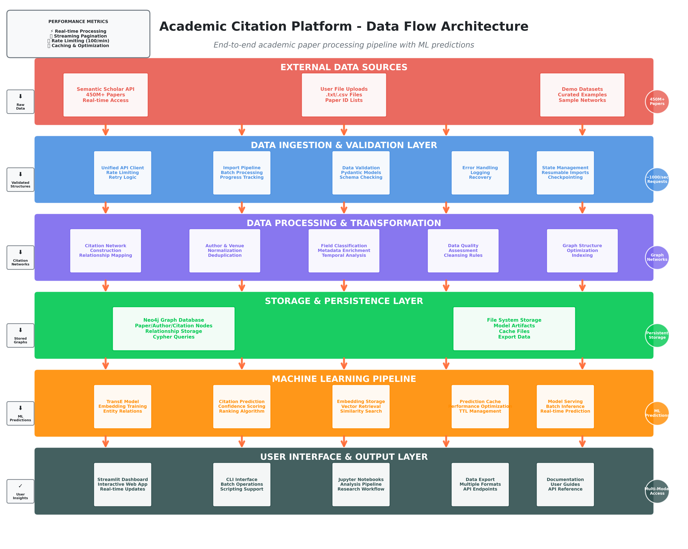

<div class="hero-section" markdown style="text-align: center; padding: 35px 20px; background: linear-gradient(135deg, #546e7a 0%, #37474f 100%); border-radius: 10px; margin-bottom: 30px;">

<span style="font-size: 2.5em; color: white;">:material-graph-outline:</span>

<h1 style="color: white; margin-top: 8px; margin-bottom: 12px; font-size: 1.8em;">Citation Compass</h1>

<p style="color: rgba(255, 255, 255, 0.95); font-size: 1.1em; max-width: 750px; margin: 0 auto 20px;">
Explore citation networks, predict research connections, and analyze scholarly impact—powered by machine learning and graph analytics.
</p>

<div class="hero-buttons" markdown>
[:material-rocket-launch: Get Started](getting-started.md){ .md-button .md-button--primary }
[:material-play-circle: Live Demo](https://cartography.barbhs.com/){ .md-button }
[:material-github: GitHub](https://github.com/dagny099/citation-compass){ .md-button }
</div>

</div>

---

## 📚 Documentation Sections

<div class="grid cards" markdown>

-   [:material-home: **Home**](index.md)

    Overview, quick start, and navigation to all documentation

-   [:material-rocket-launch: **Getting Started**](getting-started.md)

    Installation, configuration, and your first analysis in under 10 minutes

-   [:material-account: **User Guide**](user-guide/overview.md)

    Complete walkthrough of features, workflows, and best practices

-   [:material-notebook: **Research Notebooks**](notebooks/overview.md)

    4-notebook pipeline for model training and comprehensive analysis

-   [:material-code-braces: **Developer Guide**](architecture.md)

    Architecture, API reference, and technical design decisions

-   [:material-tools: **Resources**](resources/neo4j-health-monitoring.md)

    Practical guides for Neo4j monitoring and database maintenance

</div>

---

## ⚡ Quick Start

Get running in 3 steps:

=== "🐍 Install"

    ```bash
    git clone https://github.com/dagny099/citation-compass.git
    cd citation-compass
    pip install -e ".[all]"
    ```

=== "🎭 Try Demo"

    ```bash
    streamlit run app.py
    # No database needed! Load demo datasets from sidebar
    ```

=== "🏢 Configure (Optional)"

    ```bash
    cp .env.example .env
    # Add Neo4j credentials for your own data
    # NEO4J_URI=neo4j+s://your-database
    ```

**Next**: [Full Getting Started Guide →](getting-started.md)

---

## 📊 Sample Workflows

!!! example "Common Research Workflows"

    === "🔮 Citation Prediction"
        ```mermaid
        flowchart LR
            A["📄 Input Paper"] --> B["🧠 ML Analysis"]
            B --> C["🔮 Predictions"]
            C --> D["📊 Confidence Scores"]
            D --> E["📋 Reading List"]

            style A fill:#e3f2fd
            style B fill:#fff3e0
            style C fill:#e8f5e8
            style D fill:#fce4ec
            style E fill:#f1f8e9
        ```
        1. Input a paper → Generate predictions → Validate with embeddings
        2. Explore similar work → Build reading lists → Discover connections

    === "🔗 Network Analysis"
        ```mermaid
        flowchart LR
            A["👤 Select Author/Field"] --> B["🕸️ Build Network"]
            B --> C["🎯 Detect Communities"]
            C --> D["📈 Calculate Metrics"]
            D --> E["📄 Export Report"]

            style A fill:#ffebee
            style B fill:#e0f2f1
            style C fill:#f3e5f5
            style D fill:#e8f5e8
            style E fill:#fff3e0
        ```
        1. Select author/field → Detect communities → Export LaTeX
        2. Analyze collaborations → Identify key researchers → Track influence

    === "📈 Temporal Analysis"
        ```mermaid
        flowchart LR
            A["📅 Date Range"] --> B["📊 Trend Analysis"]
            B --> C["📈 Growth Patterns"]
            C --> D["🔮 Predictions"]
            D --> E["📋 Insights"]

            style A fill:#f1f8e9
            style B fill:#e3f2fd
            style C fill:#fce4ec
            style D fill:#fff3e0
            style E fill:#e8f5e8
        ```
        1. Choose date range → Analyze trends → Generate insights
        2. Track paper impact → Monitor growth → Predict future citations

---

## 🎯 Platform Features

Citation Compass provides a comprehensive toolkit for citation network analysis, from data ingestion through final publication.

### Core Capabilities

<div class="grid cards" markdown>

-   :material-brain: **ML-Powered Predictions**

    TransE embeddings learn paper relationships in vector space, enabling citation prediction with confidence scores and similarity rankings.

-   :material-graph: **Network Analysis**

    Advanced graph algorithms detect research communities, calculate centrality measures, and analyze temporal citation trends.

-   :material-chart-line: **Interactive Visualization**

    Clickable network graphs with real-time progress tracking make exploration intuitive—from initial data import to final insights.

-   :material-file-export: **Research Export**

    Generate LaTeX tables, academic reports, and publication-ready visualizations in multiple formats (PDF, CSV, JSON).

</div>

### Data Flow Architecture

The platform orchestrates four key pipelines: data ingestion from external APIs, ML training and prediction, network analysis, and interactive visualization. Each pipeline is optimized for its specific workload with caching and validation at every step.

{ width="750" }

---

## 🏗️ Architecture Overview

Citation Compass combines **machine learning**, **graph analysis**, and **interactive visualization** for academic citation networks.

{ width="800" }

**Core Components:**

- **Streamlit Dashboard** - Interactive web interface with real-time visualizations

- **TransE ML Model** - Citation prediction using knowledge graph embeddings

- **Neo4j Database** - Graph storage optimized for citation network queries

- **Analytics Engine** - Community detection, centrality measures, temporal analysis

---

## 🤝 Community & Support

<div class="grid cards" markdown>

-   :material-github: **GitHub Repository**

    [View Source & Contribute](https://github.com/dagny099/citation-compass)

-   :material-help-circle: **Documentation**

    [Browse Complete Docs](getting-started.md)

-   :material-bug: **Issues & Support**

    [Report Issues](https://github.com/dagny099/citation-compass/issues)

-   :material-email: **Contact**

    [GitHub Discussions](https://github.com/dagny099/citation-compass/discussions)

</div>

---

<div align="center" markdown>

[](https://python.org)
[](https://neo4j.com)
[](https://streamlit.io)
[](https://opensource.org/licenses/MIT)

*Built for the research community* 🔬

</div>
