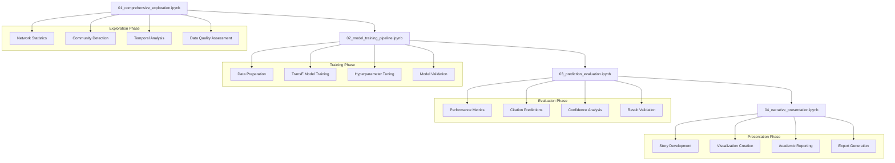

# Notebook Pipeline Overview

The Academic Citation Platform provides a comprehensive **4-notebook analysis pipeline** that guides you through complete citation network analysis, from initial exploration to compelling presentation of results.

## 📊 Pipeline Architecture



## 🔬 Notebook Descriptions

### **Notebook 1: Comprehensive Exploration**
[:material-book-open: View Details](01-comprehensive-exploration.md)

**Purpose**: Foundation analysis combining network exploration with temporal insights

**Key Features**:
- **Network Statistics**: Comprehensive metrics and graph properties
- **Community Detection**: Multiple algorithms (Louvain, Label Propagation)
- **Centrality Analysis**: PageRank, betweenness, and eigenvector centrality
- **Temporal Trends**: Citation growth patterns and seasonal analysis
- **Data Quality**: Missing data assessment and network validation

**Outputs**: Network overview, community structure, temporal insights

---

### **Notebook 2: Model Training Pipeline**
[:material-robot: View Details](02-model-training-pipeline.md)

**Purpose**: Complete TransE model training with proven methodologies

**Key Features**:
- **Data Preparation**: Negative sampling and train/test splits
- **TransE Implementation**: Graph neural network for citation prediction  
- **Training Optimization**: Learning rate scheduling and early stopping
- **Model Validation**: Cross-validation and performance monitoring
- **Model Persistence**: Saving trained models and metadata

**Outputs**: Trained TransE model, training metrics, model artifacts

---

### **Notebook 3: Prediction Evaluation**
[:material-chart-line: View Details](03-prediction-evaluation.md)

**Purpose**: Comprehensive evaluation using standard metrics and custom analysis

**Key Features**:
- **Standard Metrics**: MRR (Mean Reciprocal Rank), Hits@K, AUC scores
- **Citation Prediction**: Generate predictions with confidence scoring
- **Performance Analysis**: Model comparison and benchmarking
- **Error Analysis**: Understanding prediction failures and biases
- **Validation Studies**: Cross-validation and temporal validation

**Outputs**: Evaluation metrics, prediction datasets, performance reports

---

### **Notebook 4: Narrative Presentation**
[:material-presentation: View Details](04-narrative-presentation.md)

**Purpose**: Story-driven presentation with compelling visualizations

**Key Features**:
- **"Scholarly Matchmaking" Story**: 4-act dramatic structure
- **Portfolio Visualizations**: Publication-ready graphics
- **Academic Reporting**: LaTeX tables and statistical summaries
- **Interactive Dashboards**: Plotly-based exploration tools
- **Export Integration**: Multiple format support (PDF, HTML, LaTeX)

**Outputs**: Research narrative, presentation materials, academic reports

## 🎯 Workflow Recommendations

### For Academic Researchers

**Goal**: Understand citation patterns and discover research connections

**Recommended Path**:
```python
# 1. Start with comprehensive exploration
jupyter notebook notebooks/01_comprehensive_exploration.ipynb

# 2. Skip model training if using pre-trained models
# OR run training if you need custom models
jupyter notebook notebooks/02_model_training_pipeline.ipynb

# 3. Generate and evaluate predictions
jupyter notebook notebooks/03_prediction_evaluation.ipynb

# 4. Create compelling research narrative  
jupyter notebook notebooks/04_narrative_presentation.ipynb
```

### For Data Scientists

**Goal**: Custom model development and performance optimization

**Recommended Path**:
```python
# 1. Quick exploration for data understanding
jupyter notebook notebooks/01_comprehensive_exploration.ipynb

# 2. Deep dive into model training and tuning
jupyter notebook notebooks/02_model_training_pipeline.ipynb

# 3. Rigorous evaluation with custom metrics
jupyter notebook notebooks/03_prediction_evaluation.ipynb

# 4. Technical presentation of results
jupyter notebook notebooks/04_narrative_presentation.ipynb
```

### For Research Administrators

**Goal**: Generate reports and monitor system performance

**Recommended Path**:
```python
# 1. System overview and health check
jupyter notebook notebooks/01_comprehensive_exploration.ipynb

# 2. Skip detailed training (use existing models)
# 3. Focus on evaluation and metrics
jupyter notebook notebooks/03_prediction_evaluation.ipynb

# 4. Generate management reports
jupyter notebook notebooks/04_narrative_presentation.ipynb
```

## 🔧 Notebook Configuration

### Environment Setup

Each notebook includes environment setup and validation:

```python
# Standard imports and setup
import sys
sys.path.append('..')

# Load environment and validate setup
from dotenv import load_dotenv
load_dotenv()

# Verify database connection
from src.database.connection import Neo4jConnection
conn = Neo4jConnection()
assert conn.test_connection(), "Database connection failed"

print("✅ Environment validated - Ready for analysis!")
```

### Performance Optimization

Notebooks are optimized for different dataset sizes:

```python
# Dataset size configuration
DATASET_SIZE = 'medium'  # 'small', 'medium', 'large'

# Adjust parameters based on dataset size
config = {
    'small': {'batch_size': 256, 'max_papers': 1000},
    'medium': {'batch_size': 512, 'max_papers': 10000}, 
    'large': {'batch_size': 1024, 'max_papers': 100000}
}[DATASET_SIZE]

print(f"🔧 Configuration for {DATASET_SIZE} dataset: {config}")
```

## 📈 Output Integration

### Cross-Notebook Data Flow

Notebooks share data through standardized formats:

```python
# Notebook 1 → Notebook 2
network_analysis = {
    'statistics': network_stats,
    'communities': community_results,
    'temporal_trends': temporal_analysis
}

# Save for next notebook
with open('../outputs/01_network_analysis.pkl', 'wb') as f:
    pickle.dump(network_analysis, f)

# Notebook 2 → Notebook 3  
training_results = {
    'model_path': '../models/transe_citation_model.pt',
    'entity_mapping': entity_mapping,
    'training_metrics': training_history
}

# Save for evaluation
with open('../outputs/02_training_results.pkl', 'wb') as f:
    pickle.dump(training_results, f)
```

### Export Compatibility

All notebooks support multiple export formats:

```python
from src.analytics.export_engine import ExportEngine

exporter = ExportEngine()

# Generate exports in multiple formats
exports = exporter.export_analysis_results(
    analysis_results,
    formats=['html', 'pdf', 'latex', 'json'],
    output_dir='../outputs/'
)

print(f"📄 Generated {len(exports)} export files")
```

## 🚀 Quick Start Guide

### Option 1: Run Complete Pipeline

```bash
# Execute all notebooks in sequence
cd notebooks/
jupyter nbconvert --execute 01_comprehensive_exploration.ipynb
jupyter nbconvert --execute 02_model_training_pipeline.ipynb  
jupyter nbconvert --execute 03_prediction_evaluation.ipynb
jupyter nbconvert --execute 04_narrative_presentation.ipynb
```

### Option 2: Interactive Exploration

```bash
# Launch Jupyter and explore interactively
jupyter notebook notebooks/

# Start with notebook 01 and work through the pipeline
```

### Option 3: Streamlit Integration

```bash
# Launch Streamlit dashboard with notebook integration
streamlit run app.py

# Navigate to "Notebook Pipeline" page for guided workflow
```

## 🎨 Visualization Gallery

The notebooks produce a rich variety of visualizations:

### Network Visualizations
- **Community Detection**: Interactive network graphs with community coloring
- **Centrality Analysis**: Node-sized networks showing influential papers
- **Temporal Evolution**: Animation of network growth over time

### ML Model Visualizations  
- **Training Progress**: Loss curves and convergence monitoring
- **Embedding Spaces**: 2D/3D projections of paper embeddings
- **Prediction Confidence**: Confidence distribution analysis

### Performance Metrics
- **Evaluation Dashboards**: Interactive metric exploration
- **Comparison Charts**: Model performance comparisons
- **Error Analysis**: Prediction failure case studies

## 📋 Best Practices

### Code Organization

```python
# Use consistent structure across notebooks
def setup_environment():
    """Initialize environment and validate setup."""
    pass

def load_data():
    """Load and prepare analysis data."""
    pass

def run_analysis():
    """Execute main analysis pipeline.""" 
    pass

def generate_visualizations():
    """Create analysis visualizations."""
    pass

def export_results():
    """Save results in multiple formats."""
    pass
```

### Documentation Standards

- **Clear section headers** with emoji icons
- **Comprehensive markdown explanations** before code blocks
- **Inline comments** explaining complex operations
- **Parameter documentation** for configuration options
- **Output descriptions** explaining generated artifacts

### Performance Guidelines

1. **Memory Management**: Clear large variables when no longer needed
2. **Progress Tracking**: Use tqdm for long-running operations
3. **Error Handling**: Include try-catch blocks for external dependencies
4. **Caching Strategy**: Save intermediate results for expensive computations

## 🔗 Integration with Platform

### Streamlit Dashboard Integration

```python
# Notebooks can be launched from Streamlit
import streamlit as st

if st.button("Launch Analysis Notebook"):
    # Open notebook in new tab
    st.markdown("[Open 01_comprehensive_exploration.ipynb](notebooks/01_comprehensive_exploration.ipynb)")
```

### API Service Integration

```python
# Notebooks use the same services as the dashboard
from src.services.analytics_service import get_analytics_service
from src.services.ml_service import get_ml_service

# Ensures consistency across all platform interfaces
analytics = get_analytics_service()
ml_service = get_ml_service()
```

---

Ready to start your analysis journey? **[Begin with Notebook 1 →](01-comprehensive-exploration.md)**