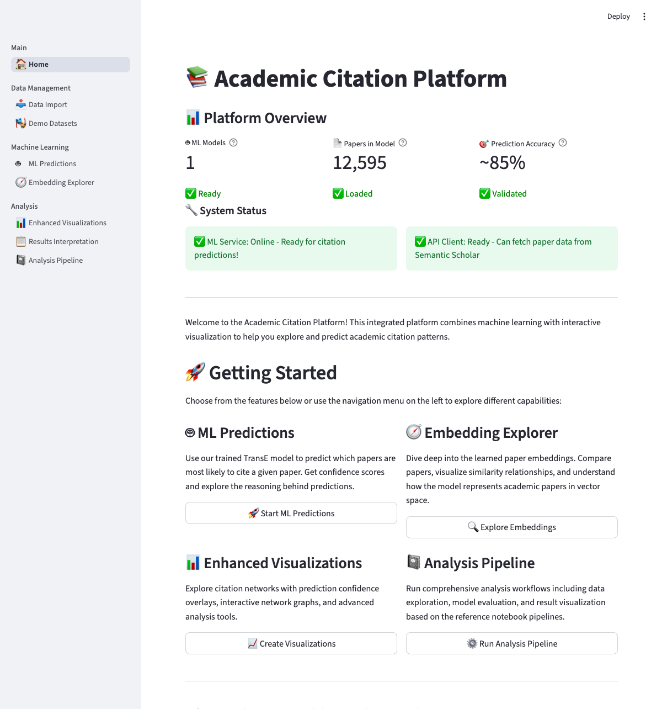

# Interactive Features Guide

Explore citation networks using the enhanced interactive Streamlit dashboard interface. Discover powerful new features including demo datasets, file upload, clickable network nodes, and real-time progress tracking.

## Overview

**Citation Compass** provides an interactive web interface built with **Streamlit**. This guide covers the point-and-click features available through the dashboard, including recent enhancements for usability.

## 🚀 Getting Started

### Launching the Dashboard

```bash
# Start the interactive dashboard
streamlit run app.py
```

The dashboard will open in your browser at `http://localhost:8501` with a multi-page interface.

## 📊 Dashboard Pages

### 1. Home Page

**Location**: Main landing page

**Features**:
- **Enhanced platform overview** with featured capabilities prominently displayed
- **Quick navigation cards** to all major features with visual previews
- **System status indicators** showing database, ML service, and analytics readiness
- **Getting started guidance** with personalized recommendations

{ width="800" }

### 2. 🎭 Demo Datasets

**Location**: Demo Datasets (in sidebar)

**Features**:
- **Instant data exploration** - No setup required!
- **Curated academic datasets** from multiple research fields
- **Dataset browser** with expandable statistics (papers, citations, authors)
- **One-click loading** with real-time progress indicators
- **Dataset comparison** charts and performance metrics
- **Offline mode** - Full functionality without database connection

!!! tip "Start Here!"
    Perfect for new users! Load the complete_demo dataset to explore all platform features with realistic academic data.

### 3. 📥 Data Import & File Upload

**Location**: Data Management → Data Import

**Features**:
- **Multiple import methods**: Search queries, paper IDs, or file upload
- **Drag-and-drop file upload** for .txt and .csv files with paper ID collections
- **Real-time progress tracking** with streaming updates and performance metrics
- **Sample file downloads** for testing and validation
- **Advanced configuration** with quality filters and batch processing options
- **Error handling** with detailed reporting and recovery options

### 4. ML Predictions

**Location**: Machine Learning → ML Predictions

**Enhanced Features**:
- **Demo mode support** - Works with offline synthetic embeddings
- Citation prediction interface with improved confidence visualization
- Paper search with autocomplete and validation
- **Batch prediction capabilities** for multiple papers
- Interactive result exploration with sorting and filtering

{ width="800" }

!!! info "Demo Mode Available"
    ML predictions work in demo mode using realistic synthetic embeddings. No trained model required for testing!

### 5. Embedding Explorer  

**Location**: Machine Learning → Embedding Explorer

**Enhanced Features**:
- **Demo embeddings** - Explore synthetic embeddings that cluster by research field
- Interactive scatter plots with enhanced zoom and selection tools
- **Field-aware visualization** - Papers cluster realistically by domain
- Similarity exploration with confidence metrics

{ width="800" }

### 6. 🔗 Enhanced Visualizations with Clickable Nodes

**Location**: Analysis → Enhanced Visualizations

**New Interactive Features**:
- **Clickable network nodes** - Click papers to view detailed information
- **Interactive citation paths** - Trace relationships between papers
- **Dynamic filtering controls** - Real-time network updates
- **Enhanced layouts** - Improved force-directed and hierarchical arrangements
- **Performance optimizations** - Smooth rendering for larger networks
- Export capabilities with high-resolution outputs

{ width="800" }

### 7. Results Interpretation

**Location**: Analysis → Results Interpretation

**Features**:
- Academic performance metrics with traffic-light indicators
- **Enhanced statistical interpretation** with context and benchmarking
- Comparison against academic standards
- **Improved report generation** with LaTeX and PDF export options

### 8. Analysis Pipeline

**Location**: Analysis → Analysis Pipeline  

**Enhanced Features**:
- Interactive notebook execution with **real-time progress tracking**
- **Streaming parameter updates** during analysis
- Enhanced progress monitoring with detailed status information
- Result visualization with improved interactivity

## 🎯 Key Interactive Features

### 🎭 Demo Mode Exploration

**Instant Access**:
- **No database required** - Works without additional setup
- **Realistic academic data** - Curated papers from AI, neuroscience, physics, and more
- **Full offline functionality** - Complete feature access without internet
- **Educational workflows** - Learn concepts with guided examples

**Dataset Management**:
- **Interactive dataset browser** with expandable details
- **One-click dataset switching** between different research domains
- **Performance monitoring** - Load times, memory usage, processing speed
- **Comparison tools** - Side-by-side dataset statistics

### 📁 File Upload & Import

**Upload Interface**:
- **Drag-and-drop functionality** for .txt and .csv files
- **Real-time file validation** with immediate feedback
- **Preview capabilities** - See first 10 paper IDs before import
- **Sample file downloads** - Get started with provided examples

**Import Progress**:
- **Streaming progress updates** with real-time statistics
- **Performance metrics** - Papers/second, success rates, error tracking
- **Status indicators** - Visual progress bars and completion notifications
- **Error reporting** - Detailed messages for troubleshooting

### 🔍 Enhanced Search and Discovery

**Advanced Paper Search**:
- **Intelligent autocomplete** with search suggestions
- **Multi-field search** by title, author, venue, or keywords
- **Advanced filtering** by publication year, citation count, research field
- **Bulk operations** - Select and process multiple papers simultaneously

**Network Exploration with Clickable Nodes**:
- **Interactive node clicking** - Click any paper to view detailed information
- **Citation path tracing** - Follow citation relationships visually
- **Dynamic zoom and pan** with smooth animations
- **Real-time filtering** - Update network display instantly
- **Enhanced highlighting** - Emphasize important nodes and connections

### 🤖 ML Prediction Interface

**Demo-Enhanced Predictions**:
- **Offline prediction mode** - Works with synthetic embeddings when no trained model available
- **Confidence visualization** - Interactive confidence score displays
- **Field-aware results** - Predictions consider research domain relationships
- **Temporal intelligence** - Results reflect realistic academic citation patterns

**Advanced Input Methods**:
- **Smart paper ID validation** - Real-time format checking
- **Title-based search** with fuzzy matching
- **Batch prediction processing** for multiple papers
- **Result comparison** - Compare predictions across different papers

### 🎨 Visualization Controls

**Interactive Network Elements**:
- **Clickable nodes** with hover information and detailed pop-ups
- **Dynamic filtering controls** - Adjust network display in real-time
- **Color coding options** - Research fields, publication years, citation counts
- **Layout algorithms** - Force-directed, hierarchical, circular, and custom layouts
- **Animation controls** - Smooth transitions and interactive animations

**Enhanced Export Options**:
- **High-resolution image export** - PNG, SVG, PDF formats
- **Interactive HTML exports** - Shareable network visualizations
- **Academic report generation** - LaTeX tables and formatted documents
- **Data export formats** - JSON, CSV, GraphML for further analysis

### 📊 Real-Time Analytics

**Live Performance Monitoring**:
- **Processing speed indicators** - Real-time analysis performance
- **Memory usage tracking** - Monitor system resource utilization
- **Progress streaming** - Live updates during long-running operations
- **Error rate monitoring** - Track and display operation success rates

**Interactive Statistics**:
- **Dynamic metric updates** - Statistics change as you filter and explore
- **Comparative analysis** - Benchmark against academic standards
- **Traffic-light indicators** - Quick quality assessment with color coding
- **Trend visualization** - See patterns emerge as you explore data

## 🔧 Customization Options

### Dashboard Configuration

Most features can be customized through the interface:

- **Display preferences**: Theme, layout, font sizes
- **Analysis parameters**: Algorithm settings, thresholds
- **Visualization options**: Colors, node sizes, edge styles
- **Export formats**: File types, quality settings

### Session Management

- **State persistence**: Settings saved between sessions
- **Progress tracking**: Analysis history and bookmarks
- **Data caching**: Improved performance for repeated queries
- **Export history**: Access previous exports

## 📈 Performance Tips

### Optimizing Interactive Performance

1. **Start with Demo Mode**: Use demo datasets to learn features without performance overhead
2. **Progressive Data Loading**: Begin with smaller datasets before importing large collections
3. **Smart Caching**: Enable caching for repeated analyses - works automatically
4. **Browser Optimization**: Use Chrome or Firefox for best Streamlit performance
5. **Resource Management**: Close unused browser tabs and applications
6. **Streaming Features**: Take advantage of real-time progress updates for better UX

### Memory Management for Large Networks

- **Use filtering controls** to reduce displayed network size
- **Enable demo mode** for resource-constrained environments
- **Monitor real-time metrics** displayed in the interface
- **Leverage clickable nodes** instead of displaying all details at once
- **Clear cache periodically** using built-in cache management
- **Restart session** if performance degrades (automatic session management available)

### New Performance Features

- **Streaming pagination** - Faster data loading for large imports
- **Intelligent batching** - Automatic batch size optimization
- **Real-time progress** - Live updates without blocking the interface
- **Offline capabilities** - Full functionality without network dependencies

## 🛠️ Troubleshooting

### Common Issues

=== "Dashboard Loading"
    **Dashboard Won't Load**:
    - ✅ Check that `streamlit run app.py` completed successfully
    - ✅ Verify port 8501 is available and not blocked by firewall
    - ✅ Try refreshing the browser and clearing cache
    - ✅ Check terminal for any startup errors or missing dependencies

    **Slow Dashboard Loading**:
    - ✅ **Try demo mode first** - Loads instantly without database connection
    - ✅ Check system resources and close unnecessary applications
    - ✅ Verify database connection if using production mode
    - ✅ Use browser developer tools to check for JavaScript errors

=== "Feature Issues"
    **Demo Datasets Not Loading**:
    - ✅ Try loading smaller minimal_demo dataset first
    - ✅ Refresh the page and try again
    - ✅ Check browser console for error messages
    - ✅ Ensure adequate browser memory (close other tabs)

    **File Upload Failing**:
    - ✅ Verify file format (.txt with IDs per line, or .csv with IDs in first column)
    - ✅ Check file encoding (should be UTF-8)
    - ✅ Try with provided sample files first
    - ✅ Ensure file size is under 200MB

    **ML Predictions Not Working**:
    - ✅ **Load demo dataset first** - Provides synthetic embeddings
    - ✅ If using production mode, verify trained models exist in models/ directory
    - ✅ Check that ML service initialization completed successfully
    - ✅ Try with known paper IDs from loaded dataset

=== "Performance Issues"
    **Slow Network Visualizations**:
    - ✅ **Use demo datasets** for smooth performance testing
    - ✅ Reduce network size using filtering controls
    - ✅ Try different layout algorithms (some are faster)
    - ✅ Enable data sampling for very large networks

    **Import Progress Stalling**:
    - ✅ Check internet connection stability
    - ✅ Verify API rate limits haven't been exceeded
    - ✅ Try reducing batch size in import configuration
    - ✅ Monitor system memory usage during import

### New Troubleshooting Tools

- **Real-time status indicators** - Check service health in the interface
- **Progress monitoring** - See detailed import and processing status
- **Error reporting** - Detailed error messages with suggestions
- **Demo mode fallback** - Switch to offline mode if database issues occur

### Getting Help

- **Check browser console** for JavaScript error messages
- **Review Streamlit logs** in the terminal for Python errors
- **Use demo mode** to isolate issues from data/database problems
- **Visit [GitHub Issues](https://github.com/dagny099/citation-compass/issues)** for community support
- **Check documentation** for [file upload guide](../getting-started/file-upload.md) and [demo mode guide](../getting-started/demo-mode.md)

## 🎨 Advanced Usage

### Custom Visualizations

The dashboard supports custom visualization parameters:

- **Network layouts**: Force-directed, circular, hierarchical
- **Color schemes**: Categorical, continuous, custom palettes
- **Node sizing**: By citation count, centrality, or custom metrics
- **Edge styling**: Thickness, opacity, color coding

### Integration with External Tools

- **Export compatibility**: Gephi, Cytoscape, NetworkX formats
- **API endpoints**: RESTful interface for external applications
- **Embedding integration**: Compatible with TensorBoard, UMAP

## 📚 Next Steps

Ready to dive deeper? Explore these related guides:

=== "🎭 New User Path"
    1. **[Demo Mode](../getting-started/demo-mode.md)** - Start here (no database required)
    2. **[Demo Datasets](demo-datasets.md)** - Explore curated academic research data  
    3. **[File Upload](../getting-started/file-upload.md)** - Import your own research collections
    4. **[Data Import](data-import.md)** - Advanced import pipeline features

=== "🔬 Analysis Path"
    1. **[Network Analysis](network-analysis.md)** - Advanced graph analysis features
    2. **[ML Predictions](ml-predictions.md)** - Machine learning capabilities  
    3. **[Results Interpretation](results-interpretation.md)** - Understanding your results
    4. **[Notebook Pipeline](notebook-pipeline.md)** - Programmatic analysis workflows

=== "⚙️ Technical Path"
    1. **[Configuration](../getting-started/configuration.md)** - Database and API setup
    2. **[Developer Guide](../architecture.md)** - Platform architecture
    3. **[API Reference](../api/services.md)** - Programmatic interfaces
    4. **[Performance Optimization](../getting-started/configuration.md)** - Scaling and tuning

## 🎯 Quick Start Recommendations

### For Researchers New to Citation Analysis
**Start with**: [Demo Mode](../getting-started/demo-mode.md) → Load complete_demo → Explore Enhanced Visualizations → Try ML Predictions

### For Data Scientists  
**Start with**: [Demo Datasets](demo-datasets.md) → API exploration → [Notebook Pipeline](notebook-pipeline.md) → Custom model training

### For Research Administrators
**Start with**: [Demo Mode](../getting-started/demo-mode.md) → [File Upload](../getting-started/file-upload.md) → [Data Import](data-import.md) → Scale planning

---

*Happy exploring with enhanced interactive features! 🚀✨*
