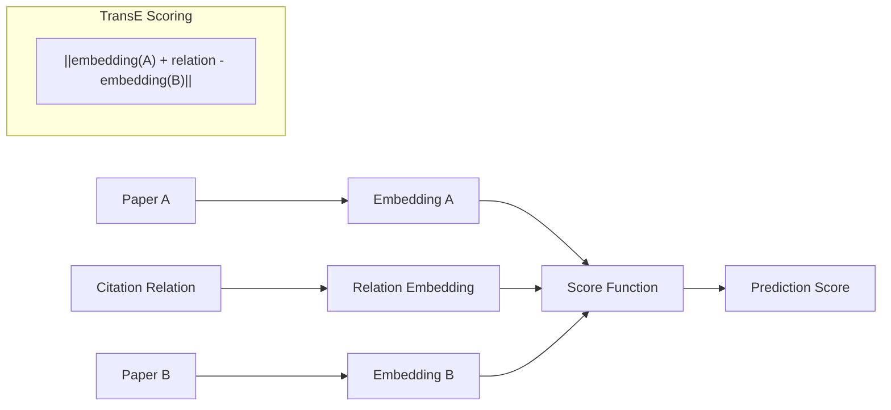

# ML Predictions Guide

Master citation prediction using TransE embeddings and advanced machine learning techniques.

## Overview

The **ML Predictions** system uses **TransE (Translating Embeddings)** to learn semantic relationships between papers and predict citation patterns. This guide covers everything from basic prediction generation to advanced model customization.

## 🧠 Understanding TransE Embeddings

### The TransE Approach

TransE learns paper embeddings where citation relationships follow the translation principle:

```
If Paper A cites Paper B, then: embedding(A) + relation ≈ embedding(B)
```

**Key Benefits**:
- **Semantic Understanding**: Captures topical similarity between papers
- **Relationship Modeling**: Learns citation patterns in vector space
- **Scalability**: Efficient computation for large networks
- **Interpretability**: Embeddings can be visualized and analyzed

### Model Architecture



## 🚀 Getting Started with Predictions

### Dashboard Interface

#### Step 1: Access ML Predictions Page

1. Launch Streamlit dashboard: `streamlit run app.py`
2. Navigate to **"ML Predictions"** in the sidebar
3. Verify model status (should show "✅ Model Loaded")

#### Step 2: Generate Basic Predictions

=== "By Paper ID"

    ```python
    # Enter paper ID directly
    paper_id = "your_paper_id_here"
    top_k = 10  # Number of predictions
    
    # Click "Generate Predictions" button
    ```

=== "By Paper Search"

    ```python
    # Search by title or keywords
    search_query = "machine learning citation networks"
    
    # Select paper from search results
    # Click "Generate Predictions" button
    ```

#### Step 3: Interpret Results

The prediction results include:

- **Target Paper**: Predicted citation target
- **Confidence Score**: Model confidence (0.0 - 1.0)
- **Raw Score**: Underlying TransE score
- **Paper Details**: Title, authors, venue, year

### Notebook Interface

For advanced users, use the comprehensive notebook pipeline:

```python
# Load ML service
from src.services.ml_service import get_ml_service

ml_service = get_ml_service()

# Generate predictions for a paper
paper_id = "example_paper_id"
predictions = await ml_service.predict_citations(
    paper_id=paper_id,
    top_k=10,
    threshold=0.5
)

# Display results
for pred in predictions:
    print(f"📄 {pred.target_title}")
    print(f"   Authors: {', '.join(pred.target_authors)}")
    print(f"   Confidence: {pred.confidence:.3f}")
    print(f"   Score: {pred.score:.3f}")
    print(f"   Year: {pred.target_year}")
    print("---")
```

## 🔬 Advanced Prediction Techniques

### Batch Predictions

Process multiple papers efficiently:

```python
# Batch prediction for multiple papers
paper_ids = ["paper1", "paper2", "paper3"]

batch_predictions = await ml_service.predict_batch_citations(
    paper_ids=paper_ids,
    top_k=5,
    threshold=0.6
)

# Results organized by source paper
for source_id, predictions in batch_predictions.items():
    print(f"\nPredictions for {source_id}:")
    for pred in predictions:
        print(f"  → {pred.target_title} ({pred.confidence:.3f})")
```

### Similarity-Based Discovery

Find papers similar to a given paper:

```python
# Find similar papers using embeddings
similar_papers = await ml_service.find_similar_papers(
    paper_id="reference_paper_id",
    similarity_threshold=0.8,
    max_results=20
)

print(f"Found {len(similar_papers)} similar papers:")
for paper in similar_papers:
    print(f"📄 {paper.title}")
    print(f"   Similarity: {paper.similarity_score:.3f}")
    print(f"   Shared keywords: {paper.shared_keywords}")
```

### Confidence Analysis

Analyze prediction confidence distributions:

```python
import numpy as np
import matplotlib.pyplot as plt

# Generate predictions with confidence analysis
predictions = await ml_service.predict_citations(
    paper_id="target_paper",
    top_k=100,  # Get more predictions for analysis
    include_confidence_intervals=True
)

# Extract confidence scores
confidences = [p.confidence for p in predictions]

# Plot confidence distribution
plt.figure(figsize=(10, 6))
plt.hist(confidences, bins=20, alpha=0.7, edgecolor='black')
plt.xlabel('Prediction Confidence')
plt.ylabel('Number of Predictions')
plt.title('Prediction Confidence Distribution')
plt.axvline(np.mean(confidences), color='red', linestyle='--', 
           label=f'Mean: {np.mean(confidences):.3f}')
plt.legend()
plt.show()

# High-confidence predictions
high_confidence = [p for p in predictions if p.confidence > 0.8]
print(f"High-confidence predictions: {len(high_confidence)}")
```

## 🎨 Embedding Visualization

### 2D Embedding Plots

Visualize paper relationships in embedding space:

```python
from sklearn.manifold import TSNE
import plotly.express as px

# Get embeddings for a set of papers
paper_ids = ["paper1", "paper2", "paper3", ...]
embeddings = await ml_service.compute_embeddings(paper_ids)

# Reduce dimensionality for visualization
tsne = TSNE(n_components=2, random_state=42)
embeddings_2d = tsne.fit_transform(embeddings)

# Create interactive plot
fig = px.scatter(
    x=embeddings_2d[:, 0],
    y=embeddings_2d[:, 1],
    hover_name=paper_titles,
    hover_data={
        'Authors': paper_authors,
        'Year': paper_years,
        'Citations': paper_citations
    },
    title='Paper Embeddings in 2D Space'
)

fig.show()
```

### Clustering Analysis

Discover paper clusters in embedding space:

```python
from sklearn.cluster import KMeans

# Perform clustering on embeddings
n_clusters = 5
kmeans = KMeans(n_clusters=n_clusters, random_state=42)
cluster_labels = kmeans.fit_predict(embeddings)

# Analyze clusters
for cluster_id in range(n_clusters):
    cluster_papers = [paper_ids[i] for i, label in enumerate(cluster_labels) 
                     if label == cluster_id]
    print(f"\nCluster {cluster_id}: {len(cluster_papers)} papers")
    
    # Show representative papers
    for paper_id in cluster_papers[:3]:
        paper = await database.get_paper(paper_id)
        print(f"  - {paper.title}")
```

## 🎯 Model Training and Customization

### Training Your Own Model

For domain-specific applications, train custom models:

```python
from src.services.ml_service import TransEModelService
from src.models.ml import TrainingConfig

# Configure training
config = TrainingConfig(
    embedding_dim=128,
    learning_rate=0.01,
    epochs=100,
    batch_size=1024,
    margin=1.0,
    negative_sampling_ratio=1,
    validation_split=0.2
)

# Initialize trainer
trainer = TransEModelService()

# Load training data
training_data = await database.get_citation_network(
    min_citations=5,  # Filter for quality
    time_range=(2018, 2023)
)

# Train model
training_result = await trainer.train(
    data=training_data,
    config=config,
    checkpoint_dir="models/checkpoints/",
    verbose=True
)

print(f"Training completed in {training_result.training_time:.2f} seconds")
print(f"Final loss: {training_result.final_loss:.4f}")
print(f"Best validation MRR: {training_result.best_mrr:.3f}")
```

### Hyperparameter Optimization

Optimize model performance:

```python
from sklearn.model_selection import GridSearchCV
import itertools

# Define hyperparameter search space
param_grid = {
    'embedding_dim': [64, 128, 256],
    'learning_rate': [0.001, 0.01, 0.1],
    'margin': [0.5, 1.0, 2.0],
    'negative_sampling_ratio': [1, 2, 5]
}

# Grid search with cross-validation
best_params = None
best_score = -float('inf')

for params in itertools.product(*param_grid.values()):
    config_dict = dict(zip(param_grid.keys(), params))
    config = TrainingConfig(**config_dict)
    
    # Train and evaluate model
    result = await trainer.train_and_evaluate(
        data=training_data,
        config=config,
        cv_folds=3
    )
    
    if result.avg_mrr > best_score:
        best_score = result.avg_mrr
        best_params = config_dict

print(f"Best parameters: {best_params}")
print(f"Best MRR score: {best_score:.3f}")
```

## 📊 Evaluation and Validation

### Standard Metrics

Evaluate model performance using standard metrics:

```python
# Comprehensive evaluation
evaluation_result = await ml_service.evaluate_model(
    test_data=test_dataset,
    metrics=['mrr', 'hits_at_k', 'auc', 'precision', 'recall']
)

print("📈 Evaluation Results:")
print(f"MRR (Mean Reciprocal Rank): {evaluation_result.mrr:.3f}")
print(f"Hits@1: {evaluation_result.hits_at_1:.3f}")
print(f"Hits@5: {evaluation_result.hits_at_5:.3f}")
print(f"Hits@10: {evaluation_result.hits_at_10:.3f}")
print(f"AUC: {evaluation_result.auc:.3f}")
print(f"Precision@10: {evaluation_result.precision_at_10:.3f}")
print(f"Recall@10: {evaluation_result.recall_at_10:.3f}")
```

### Cross-Validation

Robust model validation:

```python
from sklearn.model_selection import TimeSeriesSplit

# Time-aware cross-validation for citation data
tscv = TimeSeriesSplit(n_splits=5)
cv_scores = []

for train_idx, test_idx in tscv.split(citation_data):
    train_data = citation_data[train_idx]
    test_data = citation_data[test_idx]
    
    # Train model on training fold
    model = await trainer.train(train_data, config)
    
    # Evaluate on test fold
    score = await model.evaluate(test_data)
    cv_scores.append(score.mrr)

print(f"Cross-validation MRR: {np.mean(cv_scores):.3f} ± {np.std(cv_scores):.3f}")
```

### Error Analysis

Understand model limitations:

```python
# Analyze prediction errors
error_analysis = await ml_service.analyze_prediction_errors(
    test_predictions=test_predictions,
    ground_truth=ground_truth_citations
)

print("🔍 Error Analysis:")
print(f"False positive rate: {error_analysis.false_positive_rate:.3f}")
print(f"False negative rate: {error_analysis.false_negative_rate:.3f}")

# Common error patterns
print("\nCommon error patterns:")
for pattern in error_analysis.error_patterns:
    print(f"- {pattern.description}: {pattern.frequency:.1%}")

# Papers with poor predictions
print("\nPapers with poor prediction quality:")
for paper in error_analysis.difficult_papers[:5]:
    print(f"- {paper.title} (MRR: {paper.mrr:.3f})")
```

## 🔧 Performance Optimization

### Caching Strategies

Optimize prediction performance with intelligent caching:

```python
# Configure prediction caching
cache_config = {
    'cache_predictions': True,
    'cache_embeddings': True,
    'cache_ttl': 3600,  # 1 hour
    'max_cache_size': 10000  # Maximum cached items
}

# Warm up cache with common predictions
popular_papers = await database.get_popular_papers(limit=100)
for paper in popular_papers:
    _ = await ml_service.predict_citations(
        paper_id=paper.paper_id,
        use_cache=True
    )

print("🔥 Cache warmed up for popular papers")
```

### Batch Processing

Efficiently process large prediction jobs:

```python
import asyncio
from typing import List

async def process_prediction_batch(
    paper_ids: List[str],
    batch_size: int = 50
) -> Dict[str, List[Prediction]]:
    """Process predictions in batches to avoid memory issues."""
    
    results = {}
    
    # Process in chunks
    for i in range(0, len(paper_ids), batch_size):
        batch = paper_ids[i:i + batch_size]
        
        # Parallel processing within batch
        tasks = [
            ml_service.predict_citations(paper_id, top_k=10)
            for paper_id in batch
        ]
        
        batch_results = await asyncio.gather(*tasks)
        
        # Store results
        for paper_id, predictions in zip(batch, batch_results):
            results[paper_id] = predictions
        
        print(f"Processed batch {i//batch_size + 1}/{(len(paper_ids) + batch_size - 1)//batch_size}")
    
    return results

# Usage
all_paper_ids = await database.get_all_paper_ids()
batch_predictions = await process_prediction_batch(all_paper_ids)
```

### GPU Acceleration

Leverage GPU for faster predictions:

```python
import torch

# Check GPU availability
if torch.cuda.is_available():
    device = "cuda"
    print(f"🚀 Using GPU: {torch.cuda.get_device_name(0)}")
else:
    device = "cpu"
    print("💻 Using CPU")

# Configure ML service for GPU
ml_config = MLConfig(
    device=device,
    batch_size=2048 if device == "cuda" else 512,
    enable_mixed_precision=True  # For newer GPUs
)

ml_service = MLService(config=ml_config)
```

## 🔍 Troubleshooting

### Common Issues

??? question "Low prediction confidence scores"

    **Symptoms**: All predictions have low confidence (< 0.3)
    
    **Potential causes**:
    - Model needs more training
    - Sparse citation network
    - Domain mismatch between training and target data
    
    **Solutions**:
    ```python
    # Check model training quality
    model_info = await ml_service.get_model_info()
    print(f"Training epochs: {model_info.epochs}")
    print(f"Training loss: {model_info.final_loss}")
    
    # Retrain with more data or epochs if needed
    if model_info.final_loss > 0.1:
        print("Model may need more training")
    ```

??? question "Slow prediction generation"

    **Symptoms**: Predictions take > 10 seconds to generate
    
    **Solutions**:
    ```python
    # Enable caching
    ml_service.enable_caching(cache_size=5000)
    
    # Use GPU if available
    ml_service.set_device("cuda")
    
    # Reduce batch size for memory efficiency
    ml_service.set_batch_size(256)
    
    # Parallel processing for multiple predictions
    predictions = await ml_service.predict_batch_citations(paper_ids)
    ```

??? question "Out of memory errors"

    **Symptoms**: CUDA out of memory or system memory errors
    
    **Solutions**:
    ```python
    # Reduce batch size
    ml_config.batch_size = 128
    
    # Clear cache between large operations
    ml_service.clear_cache()
    
    # Use CPU for large datasets
    ml_service.set_device("cpu")
    
    # Process in smaller chunks
    for chunk in chunks(paper_ids, 100):
        predictions = await ml_service.predict_batch_citations(chunk)
    ```

### Performance Monitoring

Monitor prediction system performance:

```python
class PredictionMonitor:
    def __init__(self):
        self.metrics = {
            'total_predictions': 0,
            'avg_prediction_time': 0,
            'cache_hit_rate': 0,
            'memory_usage': 0
        }
    
    async def monitor_prediction(self, paper_id: str) -> List[Prediction]:
        start_time = time.time()
        
        # Make prediction
        predictions = await ml_service.predict_citations(paper_id)
        
        # Record metrics
        prediction_time = time.time() - start_time
        self.metrics['total_predictions'] += 1
        self.metrics['avg_prediction_time'] = (
            self.metrics['avg_prediction_time'] * (self.metrics['total_predictions'] - 1) +
            prediction_time
        ) / self.metrics['total_predictions']
        
        return predictions

# Usage
monitor = PredictionMonitor()
predictions = await monitor.monitor_prediction("example_paper")
```

## 🎯 Best Practices

### Data Quality

1. **Clean Training Data**: Remove low-quality citations and duplicates
2. **Balanced Sampling**: Ensure diverse representation across domains
3. **Temporal Validation**: Use time-aware train/test splits
4. **Quality Metrics**: Monitor data quality throughout the pipeline

### Model Development

1. **Hyperparameter Tuning**: Use systematic search strategies
2. **Regular Evaluation**: Monitor performance on held-out test sets
3. **Model Versioning**: Track model versions and performance
4. **Domain Adaptation**: Fine-tune models for specific research areas

### Production Deployment

1. **Caching Strategy**: Cache frequent predictions and embeddings
2. **Load Balancing**: Distribute prediction requests across instances
3. **Monitoring**: Track prediction latency and accuracy
4. **Fallback Systems**: Implement graceful degradation for model failures

---

Master these ML prediction techniques to unlock powerful insights from your citation networks! 🚀