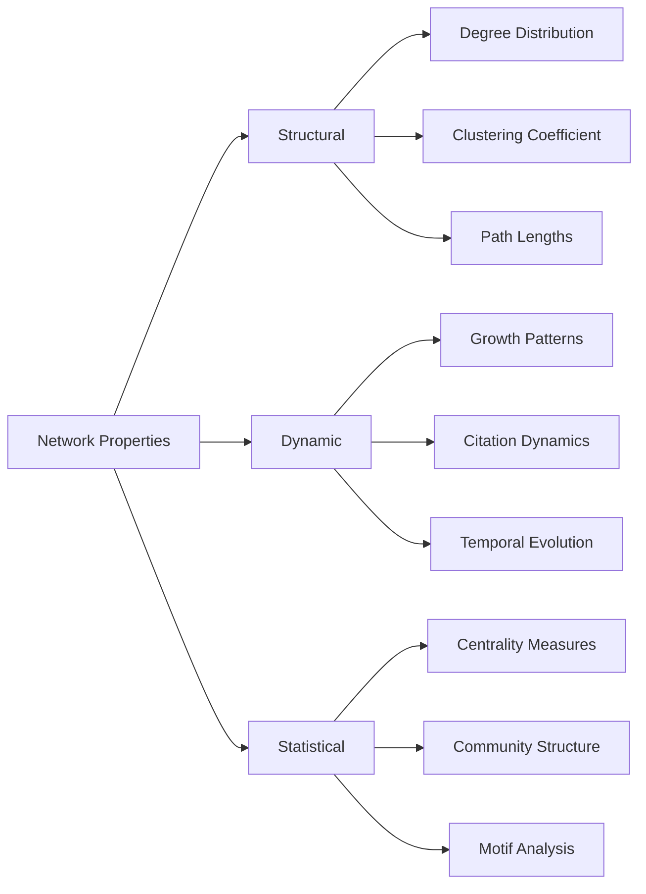
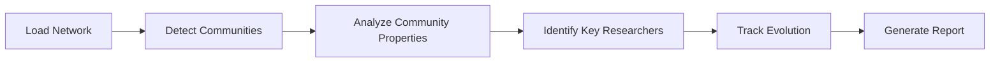
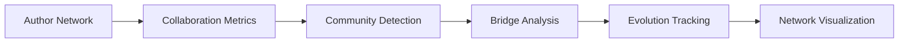

# Network Analysis Guide

Master citation network analysis using graph algorithms and advanced analytics.

## Overview

The **Network Analysis** system provides comprehensive tools for analyzing academic citation networks using graph theory and network science techniques. This guide covers community detection, centrality measures, temporal analysis, and performance metrics.

## 🕸️ Understanding Citation Networks

### Network Structure

Citation networks are **directed graphs** where:

- **Nodes** = Academic papers, authors, or venues
- **Edges** = Citation relationships (Paper A cites Paper B)
- **Attributes** = Publication year, research field, impact metrics

### Key Network Properties



## 🔍 Core Analysis Features

### 1. Community Detection

**Algorithms Available**:

- **Louvain Algorithm**: Fast modularity optimization
- **Label Propagation**: Node label spreading  
- **Leiden Algorithm**: High-quality communities
- **Spectral Clustering**: Eigenvalue-based partitioning

**Dashboard Interface**:
```python
# Access via Enhanced Visualizations page
1. Navigate to "Enhanced Visualizations"
2. Select "Community Detection" algorithm
3. Adjust resolution parameter (0.1 - 2.0)
4. Click "Detect Communities"
5. Explore color-coded results
```

**Python API**:
```python
from src.services.analytics_service import get_analytics_service

analytics = get_analytics_service()

# Detect communities in author collaboration network
communities = analytics.detect_communities(
    entity_type="author",
    algorithm="louvain",
    resolution=1.0
)

print(f"Found {len(communities)} communities")
```

### 2. Centrality Measures

**Available Metrics**:

- **Degree Centrality**: Number of connections
- **Betweenness Centrality**: Bridge importance
- **Eigenvector Centrality**: Influence quality
- **PageRank**: Authority and influence

**Interpretation Guide**:

| Metric | What It Measures | Use Case |
|--------|------------------|----------|
| Degree | Direct connections | Popular papers/authors |
| Betweenness | Bridging importance | Knowledge brokers |
| Eigenvector | Connection quality | Influential researchers |
| PageRank | Authority ranking | Impact assessment |

### 3. Temporal Analysis

**Time-based Insights**:

- **Growth Patterns**: Network expansion over time
- **Citation Dynamics**: How citations evolve
- **Emerging Communities**: New research areas
- **Impact Trajectories**: Paper influence over time

**Analysis Workflow**:
```python
# Temporal network analysis
temporal_stats = analytics.analyze_temporal_patterns(
    start_year=2010,
    end_year=2024,
    time_window="yearly"
)

# Growth rate analysis
growth_patterns = analytics.compute_growth_metrics(
    metric="citation_count",
    aggregation="quarterly"
)
```

## 📊 Performance Metrics

### Network-Level Metrics

**Structural Properties**:
- **Density**: How connected is the network?
- **Diameter**: Maximum shortest path length
- **Clustering**: Local connectivity patterns
- **Modularity**: Community structure quality

**Dashboard Access**:
1. Go to "Results Interpretation" page
2. Select "Network Statistics" tab
3. View comprehensive metrics dashboard
4. Export results for further analysis

### Paper-Level Metrics

**Citation Analysis**:
- **Citation Count**: Total incoming citations
- **Citation Velocity**: Citations per time period
- **Citation Impact**: Quality-weighted citations
- **Self-Citation Rate**: Author self-referencing

**Author-Level Metrics**:
- **H-Index**: Publication impact measure
- **Collaboration Diversity**: Co-author network breadth
- **Research Evolution**: Topic drift over time
- **Influence Score**: Network-based authority

## 🎯 Analysis Workflows

### Workflow 1: Research Community Analysis

**Objective**: Identify and analyze research communities



**Step-by-Step**:
1. **Load Data**: Import citation network
2. **Community Detection**: Run Louvain algorithm
3. **Property Analysis**: Compute community metrics
4. **Key Researchers**: Identify influential authors
5. **Temporal Tracking**: Monitor community evolution
6. **Report Generation**: Export findings

### Workflow 2: Impact Assessment

**Objective**: Assess research impact and influence


### Workflow 3: Collaboration Analysis

**Objective**: Understand collaboration patterns



## 🔧 Advanced Analysis Options

### Custom Analysis Parameters

**Community Detection Tuning**:
- **Resolution**: Controls community size (0.1 = large, 2.0 = small)
- **Random Seed**: For reproducible results
- **Minimum Size**: Filter small communities
- **Hierarchical**: Multi-level community structure

**Centrality Computation**:
- **Normalization**: Raw vs. normalized scores
- **Weighted**: Consider edge weights
- **Directed**: Account for edge direction
- **Sample Size**: For large network approximation

### Statistical Significance

**Hypothesis Testing**:
- **Community Significance**: Against random models
- **Centrality Comparison**: Statistical significance tests
- **Temporal Trends**: Change point detection
- **Correlation Analysis**: Metric relationships

## 📈 Visualization and Export

### Interactive Visualizations

**Network Plots**:
- **Force-directed layouts**: Natural clustering
- **Circular layouts**: Hierarchical structure
- **Matrix representations**: Dense connectivity
- **Temporal animations**: Evolution over time

**Statistical Charts**:
- **Distribution plots**: Degree, centrality histograms  
- **Correlation matrices**: Metric relationships
- **Time series**: Temporal trend analysis
- **Comparative plots**: Before/after analysis

### Export Options

**Data Export**:
- **CSV**: Tabular network statistics
- **GraphML**: Network structure with attributes
- **JSON**: API-compatible format
- **LaTeX**: Academic report tables

**Visualization Export**:
- **PNG/SVG**: Publication-ready graphics
- **PDF**: Complete analysis reports
- **Interactive HTML**: Shareable visualizations
- **Gephi**: Advanced network visualization

## 🛠️ Troubleshooting

### Performance Optimization

**Large Networks**:
- Use sampling for initial exploration
- Enable caching for repeated analyses
- Consider network reduction techniques
- Monitor memory usage

**Algorithm Selection**:
- **Small networks** (< 1000 nodes): Any algorithm
- **Medium networks** (1K-10K): Louvain, Label Propagation
- **Large networks** (> 10K): Fast approximations

### Common Issues

**Memory Errors**:
- Reduce network size through filtering
- Use streaming algorithms for large networks
- Increase available system memory

**Slow Performance**:
- Enable multi-threading where available
- Use approximate algorithms for initial analysis
- Cache intermediate results

## 📚 Further Reading

### Academic Background

- **Network Science**: Barabási, A-L. "Network Science"
- **Social Network Analysis**: Wasserman & Faust
- **Graph Mining**: Chakrabarti & Faloutsos
- **Citation Analysis**: Garfield, E. "Citation Indexing"

### Algorithmic Details

- **Community Detection**: Fortunato & Hric (2016)
- **Centrality Measures**: Newman (2010)  
- **Temporal Networks**: Holme & Saramäki (2012)
- **Network Statistics**: Kolaczyk & Csárdi (2014)

## 🎯 Next Steps

Enhance your network analysis skills:

- **[Interactive Features](interactive-features.md)** - Dashboard visualization tools
- **[Results Interpretation](results-interpretation.md)** - Understanding analysis outputs
- **[ML Predictions](ml-predictions.md)** - Combine with machine learning
- **[Notebook Pipeline](notebook-pipeline.md)** - Programmatic analysis workflows

---

*Master the networks! 🕸️📊*