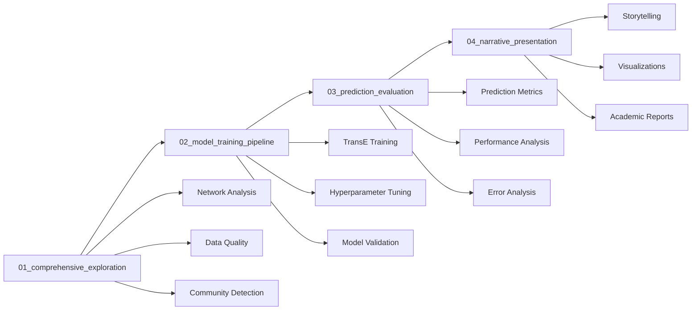

# Notebook Pipeline Guide

Master the comprehensive 4-notebook analysis pipeline for end-to-end citation research.

## Overview

The **Notebook Pipeline** provides a structured, **4-notebook workflow** that takes you from initial data exploration through model training to publication-ready results. This is the most comprehensive way to analyze citation networks programmatically.

## 📚 4-Notebook Architecture



## 🔬 Notebook 1: Comprehensive Exploration

**File**: `notebooks/01_comprehensive_exploration.ipynb`

**Purpose**: Deep dive into your citation network structure and properties

### What You'll Learn

- **Network Statistics**: Size, density, connectivity patterns
- **Community Structure**: Research clusters and collaboration patterns  
- **Temporal Dynamics**: How the network evolves over time
- **Data Quality**: Missing data, outliers, and inconsistencies

### Key Analyses

**Network Overview**:
```python
# Example outputs from the notebook
Network Statistics:
- Papers: 15,420
- Authors: 8,932  
- Citations: 45,670
- Average citations per paper: 2.96
- Network density: 0.0003
```

**Community Detection**:
```python
# Discover research communities
communities = detect_communities(graph, method="louvain")
print(f"Found {len(communities)} research communities")

# Top communities by size
for i, community in enumerate(communities[:5]):
    print(f"Community {i}: {len(community)} papers")
```

**Temporal Analysis**:
```python
# Citation growth patterns
yearly_stats = analyze_temporal_patterns(
    start_year=2010, 
    end_year=2024
)
```

### Expected Outputs

- **Network visualization**: Interactive plots of citation structure
- **Community maps**: Research cluster identification
- **Growth charts**: Temporal evolution analysis
- **Quality report**: Data validation and recommendations

## 🧠 Notebook 2: Model Training Pipeline

**File**: `notebooks/02_model_training_pipeline.ipynb`

**Purpose**: Train TransE models for citation prediction

!!! warning "Prerequisites"
    Complete Notebook 1 first for data understanding and validation

### Training Pipeline

**Data Preparation**:
```python
# Prepare training data
train_data, val_data, test_data = prepare_citation_data(
    graph=citation_graph,
    train_ratio=0.7,
    val_ratio=0.15,
    test_ratio=0.15
)
```

**Model Configuration**:
```python
# TransE model hyperparameters
model_config = {
    'embedding_dim': 128,
    'margin': 1.0,
    'learning_rate': 0.001,
    'batch_size': 1024,
    'epochs': 100,
    'negative_sampling_ratio': 5
}
```

**Training Process**:
- **Negative sampling**: Generate negative citation examples
- **Batch processing**: Efficient training on large datasets
- **Validation monitoring**: Track training progress
- **Early stopping**: Prevent overfitting

### Model Outputs

**Saved Files**:
- `models/transe_citation_model.pt` - Trained PyTorch model
- `models/entity_mapping.pkl` - Paper/author ID mappings  
- `models/training_metadata.pkl` - Training configuration and metrics

**Training Metrics**:
```python
# Example training results
Training Results:
- Final training loss: 0.234
- Validation MRR: 0.412
- Training time: 45 minutes
- Model size: 15.3 MB
```

## 📊 Notebook 3: Prediction Evaluation

**File**: `notebooks/03_prediction_evaluation.ipynb`

**Purpose**: Comprehensive evaluation of trained citation prediction models

### Evaluation Metrics

**Ranking Metrics**:
- **MRR (Mean Reciprocal Rank)**: Average quality of top predictions
- **Hits@K**: Fraction of correct predictions in top-K results  
- **NDCG**: Normalized discounted cumulative gain

**Classification Metrics**:
- **AUC-ROC**: Area under receiver operating characteristic
- **Precision/Recall**: Prediction accuracy measures
- **F1-Score**: Harmonic mean of precision and recall

### Analysis Workflows

**Model Performance**:
```python
# Comprehensive evaluation
eval_results = evaluate_model(
    model=trained_model,
    test_data=test_data,
    metrics=['mrr', 'hits@1', 'hits@10', 'auc']
)

print(f"MRR: {eval_results['mrr']:.3f}")
print(f"Hits@10: {eval_results['hits@10']:.3f}")
```

**Prediction Analysis**:
```python
# Generate and analyze predictions
predictions = generate_predictions(
    model=trained_model,
    papers=sample_papers,
    top_k=20
)

# Confidence score distribution
plot_confidence_distribution(predictions)
```

**Error Analysis**:
- **False positives**: Why the model makes incorrect predictions
- **False negatives**: What the model misses
- **Bias analysis**: Systematic prediction errors
- **Domain performance**: How well it works across research fields

### Visualization Outputs

- **Performance charts**: Metric comparisons and trends
- **Prediction distributions**: Confidence score analysis
- **Error breakdowns**: Failure mode identification
- **Embedding visualizations**: Paper similarity in vector space

## 🎨 Notebook 4: Narrative Presentation

**File**: `notebooks/04_narrative_presentation.ipynb`

**Purpose**: Create compelling, publication-ready research narratives

### "Scholarly Matchmaking" Storytelling

This notebook follows a **4-act dramatic structure** for presenting citation analysis:

**Act 1: The Challenge**
- Research problem setup
- Data collection story
- Why citation prediction matters

**Act 2: The Discovery**  
- Network analysis reveals hidden patterns
- Community detection uncovers research clusters
- Surprising insights about collaboration

**Act 3: The Solution**
- Machine learning approach introduction
- Model training and optimization
- Prediction capabilities demonstration

**Act 4: The Vision**
- Future research recommendations
- Practical applications
- Research impact assessment

### Publication-Ready Outputs

**Academic Visualizations**:
```python
# High-quality figures for papers
create_publication_figure(
    data=network_stats,
    style="academic",
    format="png",
    dpi=300,
    size=(10, 6)
)
```

**LaTeX Tables**:
```python
# Generate LaTeX tables for papers
latex_table = generate_latex_table(
    results=evaluation_metrics,
    caption="Citation Prediction Performance",
    label="tab:results"
)
```

**Interactive Reports**:
- **HTML dashboards**: Shareable interactive results
- **Presentation slides**: Ready-to-present findings
- **Executive summaries**: High-level insights for stakeholders

## 🚀 Getting Started with the Pipeline

### Prerequisites

**System Requirements**:
- **Memory**: 8GB+ RAM (16GB recommended for large networks)
- **Storage**: 2GB+ free space for models and outputs
- **Python**: 3.8+ with Jupyter notebook support

**Data Requirements**:
- **Neo4j Database**: Connected and populated with citation data
- **Network Size**: At least 1000 papers for meaningful training
- **Time Range**: Multiple years for temporal analysis

### Launch Instructions

```bash
# Start Jupyter notebook server
jupyter notebook notebooks/

# Or use JupyterLab
jupyter lab notebooks/

# Alternative: VS Code with Jupyter extension
code notebooks/
```

### Execution Order

!!! important "Sequential Execution Required"
    The notebooks must be run in order (01 → 02 → 03 → 04) as each depends on outputs from previous stages.

**Recommended Timeline**:
- **Notebook 1**: 2-3 hours (thorough exploration)
- **Notebook 2**: 1-4 hours (depending on model training time)  
- **Notebook 3**: 1-2 hours (evaluation and analysis)
- **Notebook 4**: 2-3 hours (narrative creation and visualization)

## ⚙️ Customization Options

### Analysis Parameters

**Network Analysis**:
```python
# Customize community detection
community_params = {
    'algorithm': 'louvain',  # louvain, leiden, label_prop
    'resolution': 1.0,       # community size control
    'random_seed': 42        # reproducibility
}
```

**Model Training**:
```python
# Adjust training hyperparameters
training_params = {
    'embedding_dim': [64, 128, 256],  # embedding size options
    'learning_rate': [0.001, 0.01],   # learning rate grid search
    'batch_size': 1024,               # training batch size
    'early_stopping_patience': 10     # overfitting prevention
}
```

**Evaluation Metrics**:
```python
# Select evaluation focus
evaluation_focus = {
    'ranking_metrics': True,      # MRR, Hits@K
    'classification_metrics': True,  # AUC, Precision/Recall
    'domain_analysis': True,      # Field-specific performance
    'bias_analysis': False        # Fairness evaluation
}
```

## 📈 Performance Optimization

### Computational Efficiency

**Memory Management**:
- Use data sampling for initial exploration
- Implement batch processing for large networks
- Clear unused variables between sections
- Monitor memory usage with profiling tools

**Training Acceleration**:
- Use GPU acceleration when available
- Implement parallel negative sampling
- Enable mixed-precision training
- Use gradient checkpointing for large models

### Reproducibility

**Random Seeds**:
```python
# Set seeds for reproducible results
import random, numpy as np, torch

random.seed(42)
np.random.seed(42)  
torch.manual_seed(42)
```

**Environment Management**:
- Pin package versions in requirements
- Document system configuration
- Save model training environment details
- Version control notebook outputs

## 🔧 Troubleshooting

### Common Issues

**Notebook Won't Start**:
- Check Jupyter installation: `jupyter --version`
- Verify Python environment activation
- Install missing dependencies: `pip install -r requirements.txt`

**Memory Errors**:
- Reduce batch size for training
- Use sampling for initial exploration
- Close other applications to free memory
- Consider using a machine with more RAM

**Training Failures**:
- Check data preprocessing steps
- Verify database connection
- Monitor GPU memory if using acceleration
- Review error logs for specific issues

**Poor Model Performance**:
- Increase training data size
- Adjust hyperparameters
- Verify data quality in Notebook 1
- Try different model architectures

### Getting Help

- **Error messages**: Check cell outputs for detailed tracebacks
- **Documentation**: Each notebook has extensive markdown explanations
- **Community support**: [GitHub Discussions](https://github.com/dagny099/citation-compass/discussions)
- **Issues**: [Report bugs](https://github.com/dagny099/citation-compass/issues)

## 🎯 Advanced Usage

### Custom Analysis Extensions

**Research Domain Focus**:
```python
# Analyze specific research fields
field_analysis = analyze_by_research_field(
    network=citation_graph,
    fields=['computer_science', 'machine_learning'],
    temporal_window='2020-2024'
)
```

**Multi-Network Comparison**:
```python
# Compare different citation networks
comparison_results = compare_networks(
    networks=[network_a, network_b],
    metrics=['modularity', 'clustering', 'centrality']
)
```

**Collaborative Filtering Integration**:
```python
# Combine TransE with collaborative filtering
hybrid_model = create_hybrid_model(
    transe_model=citation_model,
    collaborative_features=author_features,
    fusion_method='linear_combination'
)
```

## 📊 Integration with Dashboard

### Notebook-Dashboard Workflow

The notebooks integrate seamlessly with the interactive dashboard:

1. **Train models** in notebooks → **Explore interactively** in dashboard
2. **Generate bulk predictions** in notebooks → **Validate individually** in dashboard  
3. **Create publication figures** in notebooks → **Present interactively** in dashboard

### Shared Outputs

- **Trained models**: Used by both notebook and dashboard
- **Analysis results**: Cached for dashboard visualization
- **Preprocessed data**: Shared between notebook and dashboard sessions

## 📚 Learning Path

### For New Users

1. **Start here**: [Interactive Features](interactive-features.md) for dashboard basics
2. **Then explore**: Notebook 1 for network understanding
3. **Deep dive**: Complete full 4-notebook pipeline
4. **Advanced**: Customize analyses for your research domain

### For Experienced Users

1. **Quick start**: Jump to Notebook 2 for model training
2. **Customize**: Modify parameters for your specific use case
3. **Extend**: Add new analyses and visualizations
4. **Share**: Create templates for your research group

## 🔗 Related Resources

- **[Network Analysis](network-analysis.md)** - Theoretical background
- **[ML Predictions](ml-predictions.md)** - Model usage details  
- **[Results Interpretation](results-interpretation.md)** - Understanding outputs
- **[Developer Guide](../developer-guide/architecture.md)** - Technical implementation

---

*Master the full pipeline! 📚🚀*