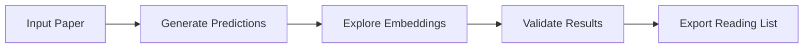
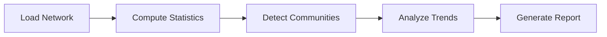
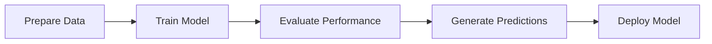

# User Guide Overview

Welcome to the user guide for Citation Compass. This guide walks you through the main features and workflows.

## Platform Components

Citation Compass provides multiple interfaces for different types of users and workflows:

### 🖥️ Interactive Dashboard (Streamlit)

The main interface for interactive exploration and analysis:

- **Real-time visualization** of citation networks
- **Point-and-click analysis** tools
- **Export capabilities** for research reports
- **Multi-page workflow** for different analysis types

### 📓 Jupyter Notebooks

Comprehensive analysis pipelines for researchers:

- **4-notebook workflow** covering exploration to presentation
- **Customizable analysis** parameters
- **Reproducible research** workflows
- **Advanced visualizations** and exports

### 🔌 Python API

Programmatic access for integration and automation:

- **Service layer APIs** for analytics and ML
- **Database abstraction** for data access
- **Export engines** for automated reporting
- **Custom model training** capabilities

## User Personas

### 🎓 Academic Researchers

**Primary needs**: Citation analysis, research discovery, publication metrics

**Recommended workflow**:
1. Start with [Interactive Features](interactive-features.md)
2. Use [Network Analysis](network-analysis.md) for community detection
3. Export results with [Results Interpretation](results-interpretation.md)

### 🤖 Data Scientists

**Primary needs**: Model training, prediction accuracy, custom analysis

**Recommended workflow**:
1. Begin with [Notebook Pipeline](notebook-pipeline.md)
2. Explore [ML Predictions](ml-predictions.md) capabilities
3. Review [Developer Guide](../architecture.md) for customization

### 📊 Research Administrators

**Primary needs**: Performance monitoring, usage analytics, reporting

**Recommended workflow**:
1. Use [Interactive Features](interactive-features.md) for overview
2. Generate reports with [Results Interpretation](results-interpretation.md)
3. Monitor performance using built-in metrics

## Feature Matrix

| Feature | Dashboard | Notebooks | API |
|---------|-----------|-----------|-----|
| Citation Prediction | ✅ Interactive | ✅ Customizable | ✅ Programmatic |
| Network Analysis | ✅ Visual | ✅ Detailed | ✅ Batch Processing |
| Community Detection | ✅ Real-time | ✅ Multiple Algorithms | ✅ Scalable |
| Temporal Analysis | ✅ Interactive | ✅ Advanced | ✅ Automated |
| Export Capabilities | ✅ Basic | ✅ Advanced | ✅ Custom Formats |
| Model Training | ❌ | ✅ Full Pipeline | ✅ Programmatic |
| Custom Visualization | ❌ | ✅ Matplotlib/Plotly | ✅ Programmatic |
| Batch Processing | ❌ | ✅ | ✅ Scalable |

## Getting Started Paths

Choose your path based on your goals:

=== "🚀 Quick Exploration"

    **Goal**: Understand your citation network quickly

    **Path**:
    1. Launch Streamlit dashboard
    2. Explore [Interactive Features](interactive-features.md)
    3. Try [Network Analysis](network-analysis.md) tools
    4. Export initial findings

=== "🔬 Research Analysis"

    **Goal**: Comprehensive citation analysis for research

    **Path**:
    1. Start with [Notebook Pipeline](notebook-pipeline.md)
    2. Follow 4-notebook workflow
    3. Use [ML Predictions](ml-predictions.md) for discovery
    4. Generate publication-ready reports

=== "⚙️ Custom Integration"

    **Goal**: Integrate platform into existing workflows

    **Path**:
    1. Review [Developer Guide](../architecture.md)
    2. Use [API Reference](../api/services.md)
    3. Explore the Python API for custom integrations

## Common Workflows

### Citation Discovery Workflow

1. **Input**: Start with a paper of interest
2. **Predict**: Generate citation predictions using ML
3. **Explore**: Visualize paper relationships in embedding space
4. **Validate**: Check predictions against known citations
5. **Export**: Create reading list with confidence scores

### Network Analysis Workflow

1. **Load**: Import or connect to citation network
2. **Statistics**: Compute centrality and clustering metrics
3. **Communities**: Identify research communities
4. **Trends**: Analyze temporal citation patterns
5. **Report**: Generate LaTeX or PDF report

### Model Training Workflow

1. **Data**: Load and prepare citation network data
2. **Train**: Train TransE model with hyperparameter optimization
3. **Evaluate**: Test with MRR, Hits@K, and AUC metrics
4. **Predict**: Generate citation predictions
5. **Deploy**: Save model for production use

## Feature Deep Dives

### 🧠 Machine Learning Capabilities

- **TransE Embeddings**: Learn paper representations in vector space
- **Citation Prediction**: Predict likely citation relationships
- **Confidence Scoring**: Quantify prediction uncertainty
- **Embedding Visualization**: Explore paper similarities

**Learn more**: [ML Predictions Guide](ml-predictions.md)

### 🕸️ Network Analysis Tools

- **Community Detection**: Discover research clusters
- **Centrality Analysis**: Identify influential papers/authors
- **Temporal Dynamics**: Track citation evolution
- **Performance Metrics**: Quantify network properties

**Learn more**: [Network Analysis Guide](network-analysis.md)

### 🎨 Visualization & Export

- **Interactive Plots**: Explore data with Plotly/Streamlit
- **Static Graphics**: Generate publication-ready figures
- **LaTeX Export**: Create academic report tables
- **Custom Formats**: JSON, CSV, and more

**Learn more**: [Results Interpretation Guide](results-interpretation.md)

## Best Practices

### 🎯 Analysis Best Practices

1. **Start Small**: Begin with sample datasets before full analysis
2. **Validate Results**: Cross-check predictions with domain knowledge
3. **Document Parameters**: Record analysis settings for reproducibility
4. **Iterate Quickly**: Use dashboard for exploration, notebooks for final analysis

### 🔧 Technical Best Practices

1. **Resource Management**: Monitor memory and CPU usage with large datasets
2. **Caching Strategy**: Enable caching for repeated analyses
3. **Error Handling**: Check logs for debugging information
4. **Version Control**: Track analysis notebooks and configurations

### 📊 Reporting Best Practices

1. **Clear Methodology**: Document analysis approaches
2. **Visual Clarity**: Use consistent styling across visualizations
3. **Statistical Rigor**: Include confidence intervals and significance tests
4. **Export Quality**: Use high-resolution formats for publications

## Support & Community

### 📖 Documentation Resources

- **[API Reference](../api/services.md)**: Complete technical documentation
- **[Developer Guide](../architecture.md)**: Architecture and customization
- **[GitHub Issues](https://github.com/dagny099/citation-compass/issues)**: Common issues and community solutions

### 🤝 Getting Help

- **GitHub Issues**: Report bugs and request features
- **Community Discussions**: Share experiences and get advice
- **GitHub Support**: [Create an issue](https://github.com/dagny099/citation-compass/issues)
- **Documentation Updates**: Contribute improvements to guides

---

## Next Steps

Ready to dive in? Choose your next destination:

-   [:material-mouse: **Interactive Features**](interactive-features.md)
    
    Explore the Streamlit dashboard and point-and-click analysis tools

-   [:material-robot: **ML Predictions**](ml-predictions.md)
    
    Learn citation prediction and embedding visualization techniques

-   [:material-graph: **Network Analysis**](network-analysis.md)
    
    Discover communities, centrality, and temporal analysis features

-   [:material-notebook: **Notebook Pipeline**](notebook-pipeline.md)
    
    Master the comprehensive 4-notebook analysis workflow

*Happy analyzing! 🔬✨*
