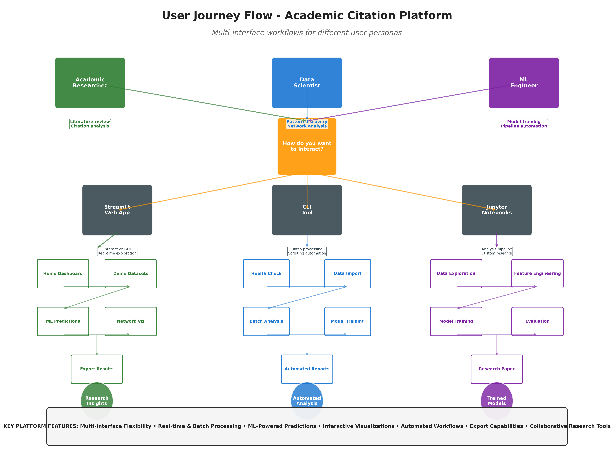

# User Guide Overview

Welcome to Citation Compass! This guide helps you choose the right interface for your needs and get started with common workflows.

---

## Platform Access

Choose your interface based on how you work:

| Interface | When to Use | Quick Start |
|-----------|-------------|-------------|
| **🖥️ Dashboard** | Interactive exploration, demos, quick analysis | `streamlit run app.py` |
| **📓 Notebooks** | Reproducible research, custom analysis, model training | `jupyter notebook notebooks/` |
| **🔌 Python API** | Automation, integration with existing tools | `from src.services import get_ml_service` |

**New to Citation Compass?** Start with the dashboard—it requires no code and provides immediate visualization.

---

## User Personas

Different users have different needs. We've designed Citation Compass to support three main personas, each with tailored workflows and entry points.

{ width="600" align=right }

### 🎓 Academic Researchers
**You want**: Citation analysis, research discovery, network visualization

**Start here**:

1. [Interactive Features](interactive-features.md) - Dashboard walkthrough

2. [Network Analysis](network-analysis.md) - Community detection and metrics

3. [Results Interpretation](results-interpretation.md) - Export for publications

### 🤖 Data Scientists
**You want**: Custom models, batch predictions, reproducible pipelines

**Start here**:

1. [Notebook Pipeline](notebook-pipeline.md) - 4-notebook workflow

2. [ML Predictions](ml-predictions.md) - Model training and evaluation

3. [Developer Guide](../architecture.md) - API customization

### 📊 Research Administrators
**You want**: Usage monitoring, team reports, performance tracking

**Start here**:

1. [Interactive Features](interactive-features.md) - Dashboard overview

2. [Results Interpretation](results-interpretation.md) - Report generation

3. [Network Analysis](network-analysis.md) - Performance metrics

 

The user journey diagram shows the typical flow from initial exploration through data analysis to final publication. Notice how most users start with demo mode to learn features before importing their own data.

---

## Getting Started Paths

=== "🚀 Quick Exploration"

    **Goal**: Try features with demo data (no setup required)

    **Steps**:
    1. Launch: `streamlit run app.py`
    2. Load demo dataset from sidebar
    3. Try [Interactive Features](interactive-features.md)
    4. Export results

    **Time**: 10 minutes

=== "🔬 Research Analysis"

    **Goal**: Analyze your citation network comprehensively

    **Steps**:
    1. Configure Neo4j database ([setup guide](../getting-started.md#database-setup))
    2. Import data via [Data Import](data-import.md)
    3. Follow [Notebook Pipeline](notebook-pipeline.md)
    4. Train models with [ML Predictions](ml-predictions.md)

    **Time**: 2-3 hours

=== "⚙️ Custom Integration"

    **Goal**: Integrate into existing research workflows

    **Steps**:
    1. Review [Developer Guide](../architecture.md)
    2. Check [API Reference](../api/services.md)
    3. Use Python API for automation
    4. Build custom dashboards/reports

    **Time**: Varies by complexity

---

## Common Workflows

### 🔍 Citation Discovery

**Goal**: Find related papers you might have missed

1. **Input**: Choose a paper from your network
2. **Predict**: Run ML predictions ([guide](ml-predictions.md))
3. **Explore**: Visualize in embedding space
4. **Validate**: Check against known citations
5. **Export**: Save reading list with scores

### 🕸️ Network Analysis

**Goal**: Understand citation communities and influence

1. **Load**: Import data or use demo
2. **Metrics**: Calculate centrality ([guide](network-analysis.md))
3. **Communities**: Run Louvain or label propagation
4. **Trends**: Analyze temporal patterns
5. **Report**: Export LaTeX tables

### 🤖 Model Training

**Goal**: Train custom ML model on your data

1. **Data**: Import citation network
2. **Train**: Use [notebook 02](notebook-pipeline.md) for TransE training
3. **Evaluate**: Check MRR, Hits@K metrics
4. **Predict**: Generate citations
5. **Deploy**: Save model for dashboard use

---

## Feature Matrix

??? info "Feature Availability by Interface (click to expand)"

    | Feature | Dashboard | Notebooks | API |
    |---------|-----------|-----------|-----|
    | Citation Prediction | ✅ Interactive | ✅ Customizable | ✅ Programmatic |
    | Network Analysis | ✅ Visual | ✅ Detailed | ✅ Batch |
    | Community Detection | ✅ Real-time | ✅ Multiple Algorithms | ✅ Scalable |
    | Temporal Analysis | ✅ Interactive | ✅ Advanced | ✅ Automated |
    | Export Capabilities | ✅ Basic | ✅ Advanced | ✅ Custom |
    | Model Training | ❌ | ✅ Full Pipeline | ✅ Programmatic |
    | Custom Visualization | ❌ | ✅ Matplotlib/Plotly | ✅ Programmatic |
    | Batch Processing | ❌ | ✅ Yes | ✅ Scalable |

    **Dashboard**: Best for exploration and demos
    **Notebooks**: Best for research and custom analysis
    **API**: Best for automation and integration

---

## Best Practices

### Analysis Tips
- **Start small**: Use demo datasets before loading large networks
- **Validate results**: Cross-check predictions with domain expertise
- **Document settings**: Record parameters for reproducibility
- **Iterate**: Dashboard for exploration → notebooks for final analysis

### Technical Tips
- **Monitor resources**: Track memory usage with large datasets
- **Enable caching**: Speeds up repeated analyses significantly
- **Check logs**: Look in `logs/` directory for debugging
- **Version control**: Track notebooks and config files

### Reporting Tips
- **Document methodology**: Explain analysis approach clearly
- **Consistent styling**: Use same color schemes across visualizations
- **Include metrics**: Add confidence intervals and statistical tests
- **High resolution**: Export figures at 300+ DPI for publications

---

## Support & Community

**Documentation**:

- [API Reference](../api/services.md) - Technical details

- [Developer Guide](../architecture.md) - Architecture and customization

- [Resources](../resources/neo4j-health-monitoring.md) - Helpful guides

**Get Help**:

- [GitHub Issues](https://github.com/dagny099/citation-compass/issues) - Bug reports and feature requests

- [GitHub Discussions](https://github.com/dagny099/citation-compass/discussions) - Community support

- [Documentation Source](https://github.com/dagny099/citation-compass/tree/main/docs) - Contribute improvements

---

## Next Steps

Choose your path forward:

-   [:material-mouse: **Interactive Features**](interactive-features.md)

    Explore the dashboard with clickable nodes and real-time progress

-   [:material-robot: **ML Predictions**](ml-predictions.md)

    Learn citation prediction and embedding visualization

-   [:material-graph: **Network Analysis**](network-analysis.md)

    Discover communities, centrality, and temporal patterns

-   [:material-notebook: **Notebook Pipeline**](notebook-pipeline.md)

    Master the 4-notebook analysis workflow

-   [:material-file-import: **Data Import**](data-import.md)

    Import your research collections with file upload or search

-   [:material-chart-line: **Demo Datasets**](demo-datasets.md)

    Try curated datasets spanning AI, neuroscience, and physics

---

*Happy analyzing! 🔬✨*

<!--
## Feature Deep Dives (Commented out - use specific guides instead)

### 🧠 Machine Learning Capabilities

- **TransE Embeddings**: Learn paper representations in vector space
- **Citation Prediction**: Predict likely citation relationships
- **Confidence Scoring**: Quantify prediction uncertainty
- **Embedding Visualization**: Explore paper similarities

**Learn more**: [ML Predictions Guide](ml-predictions.md)

### 🕸️ Network Analysis Tools

- **Community Detection**: Discover research clusters
- **Centrality Analysis**: Identify influential papers/authors
- **Temporal Dynamics**: Track citation evolution
- **Performance Metrics**: Quantify network properties

**Learn more**: [Network Analysis Guide](network-analysis.md)

### 🎨 Visualization & Export

- **Interactive Plots**: Explore data with Plotly/Streamlit
- **Static Graphics**: Generate publication-ready figures
- **LaTeX Export**: Create academic report tables
- **Custom Formats**: JSON, CSV, and more

**Learn more**: [Results Interpretation Guide](results-interpretation.md)
-->
